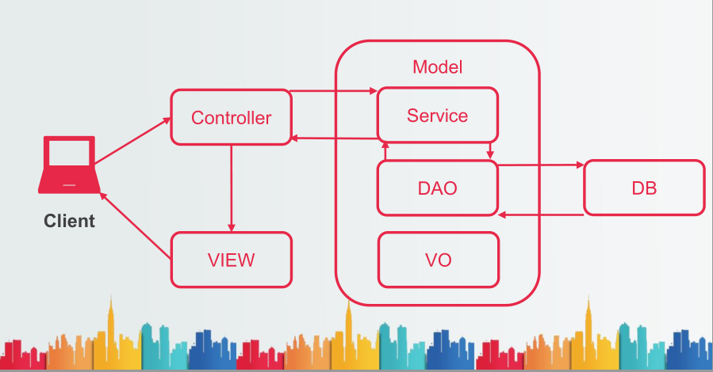

<h2>KH 정보 교육원 수업 자료<h2>

사용한 프로그램, 언어들


---


<details>
	<summary>책갈피 펼치기</summary>

[2.데이터베이스(DataBase)](#데이터베이스(database))   
  - [DBMS](#dbms(database management system))   
  - [DDL](#ddl)   
  - [집합연산자](#집합연산자(set operator))   
  - 
[4.HTML](#html)   
  - [META](#meta)     
  - [SCRIPT](#script)        
  - [LINK](#link)       
  - [영역 태그](#영역-태그)       
  - [시멘틱 태그](#시멘틱-태그)     
  - [멀티미디어 태그](#멀티미디어-태그)      
  - [하이퍼링크 태그](#하이퍼링크-태그)       
  - [폼 태그](#폼-태그)       
[5. CSS](#css)     
  - [선택자](#css-선택자)    
  - [텍스트 스타일](#텍스트-스타일)     
  - [문단 스타일](#문단스타일)   
  - [배경 스타일](#배경-스타일)     
  - [레이아웃 스타일](#레이아웃-스타일)   
  - [여백 스타일](#여백-스타일)   
  - [애니메이션](#애니메이션)   
    
[6. javascript](#javascript)   
  - [개요](#개요)   
  - [배열](#배열)   
  - [함수](#함수)   
  - [객체](#객체)   
  - [bom](#bom)    
  - [dom](#dom)     
  - [이벤트](#이벤트)    
  - [유효성검사](#유효성-검사)    
      
[7.jQuery](#jquery)       
  - [객체탐색](#객체탐색)   
  - [jQuery지원기능](#jquery-지원하는-것들)    
  - [객체조작](#객체-조작)    
  - [이벤트](#이벤트)    
	
[5.JSP/Servlet](#jsp-servlet)
  - [웹 개발 환경 구축](#웹-개발-환경-구축)    
  - [JSP Element](#jsp-element)
  - [Servlet](#servlet)    
  - [JSP](#jsp)    
  - [JSP 내장객체들](#jsp-내장-객체들)    
  - [MVC 정의](#mvc-정의)   
  - [EL](#el)   
  - [JSTL](#jstl)   

[6.UML](#uml)   


</details>

---


<details>
	<summary>유용한 사이트 링크</summary>	
  
  
1. 색추천 사이트:  https://www.webdesignrankings.com/resources/lolcolors/
1. 색추천 사이트2: https://www.webfx.com/web-design/color-picker/4CEB8B/
1. 코드 사이트 : https://www.w3schools.com/
1. db 테이블 설계 사이트 : https://aquerytool.com/
1. 순서도툴 사이트: https://app.diagrams.net/
1. JSON 툴 사이트 : http://json.parser.online.fr/
1. 고화질로 이미지로 변환해주는 사이트: https://waifu2x.booru.pics/
1. 무료이미지 지원 사이트: https://www.gettyimageskorea.com/
1. 배경 날려주는 사이트: https://www.remove.bg/ko
1. maven 추가하는 사이트: https://mvnrepository.com/
</details>


# 데이터베이스(database)

  1. DataBase 정의
  
    - 운영 데이터 : 조직의 목적을 위해 사용되는 데이터
    - 공용 데이터 : 공동으로 사용되는 데이터
    - 통합 데이터 : 중복을 최소화하여 중복으로 인한 데이터 불일치 현상 제거
    - 저장 데이터 : 컴퓨터 저장장치 저장된 데이터
    
  1. DataBase의 특징
  
    - 실시간 접근성 : 사용자가 데이터를 요청하면 실시간으로 결과를 서비스 함.
    - 계속적인 변화 : 데이터 값은 시간에 따라 항상 바뀐다.
    - 동시 공유 : 데이터베이스는 서로 다른 업무 또는 여러사용자에게 공유된다.
    - 내용에 따른 참조 : DB에 저장된 데이터는 데이터의 물리적 위치가 아니라 DB값에 따라 참조됨
    
  # dbms(database management system)
  
    - 데이터베이스에서 데이터를 추출,조작,정의,제어 등을 할 수 있게 해주는 DB 전용 관리 프로그램  
    
  1. DBMS의 기능
  
  |기능|설명|
  |:--:|:--:|
  |데이터 추출(Retrieval)|사용자가 조회하는 데이터 혹은 응용프로그램의 데이터를 추출|
  |데이터조작(Manipulation)|데이터를 조작하는 소프트웨어가 요청하는 데이터의 삽입,수정,삭제 작업을 지원|
  |데이터정의(DEfinition)|데이터의 구조를 정의하고 데이터 구조에 대한 삭제 및 변경 기능을 수행|
  |데이터제어(Control)|데이터베이스 사용자를 생성하고 모니터링하며 접근을 제어 백업과 회복,동시성 제어 등의 기능을 지원|
  
  1. DBMS 사용 이점
  
  |주요 이점|설명|
  |:--:|:--:|
  |데이터독립화|데이터와 응용 프로그램을 분리시킴으로써 상호 영향 정도를 줄인 수 있다.|
  |데이터중복 최소화 <br>데이터무결성 보장|중복되는 데이터를 최소화 시키면 데이터 무결성이 손상될 기능성이 줄어든다. <br> 중복되는 데이터를 최소화 시키면서 필요한 저장공간의 낭비를 줄일 수 있다.|
  |데이터 보안 향상|응용프로그램은 DBMS를 통해 DBMS가 허용하는 데이터에만 접근 할 수 있다.<br>권한에 맞게 데이터 접근을 제한하거나 데이터를 암호화 시켜 저장할 수 있다.|
  |관리 편의성 향상|다양한 방법으로 데이터를 백업할 수 있다.<br>장애 발생시 데이터를 복구 할 수 있다.|
  
  1. 주요 DataBase의 의 유형
  
  |데이터 모델|설명|
  |:--:|:--:|
  |계층 데이터 모델|데이터의 관계를 트리구조로 정의하고, 부모 자식형태를 갖는 구조로 데이터 중복 문제가 발생함|
  |네트워크 데이터 모델|계층형 모델의 중복문제를 해결한 구조로 데이터 간의 다양한 관계를 그물처럼 갖는 구조<br>복잡한 구조 때문에 구조 설계 및 변경이 매우 어려움|
|관계 데이터 모델|행과 열로 구성된 Table간의 관계를 나타내어 데이터를 표현하는 구조로 흔히 DBMS에서 사용하는 구조|
|객체- 관계 데이터 모델|객체 지향 데이터베이스 모델을 가진 관계형 데이터베이스로 틀 안에 정해진 <br>Table과의 관계였지만 사용자 정의 타입을 지원|

 1. 객체- 관계형 데이터베이스 특징
 
   1. 사용자 정의 타입을 지원한다.
   사용자가 임의로 정한 데이터 유형을 말하며, 기본형 데이터 타입을 뛰어 넘어 다양한 형태의 데이터를 다룰 수 있다.
   2. 참조(reference) 타입을 지원한다.
   객체들로 이루어진 객체 테이블의 경우, 하나의 레코드가 다른 레코드를 참조할 수 있는 것을 말한다.
   3. 중첩 테이블을 지원한다.
   테이블을 구성하는 로우(ROW) 자체가 또다른 테이블로 구성되는 테이블을 지원하여 조금 더 복합적인 정보표현이 가능하다.
   4. 대단위 객체의 저장, 추출이 가능하다.
   이미지, 오디오, 비디오 등을 저장하기 위한 객체를 지원한다.
   5. 객체간 상속관계를 지원한다.
   오라클의 경우 Object타입을 지원함으로써 상속기능을 구현하고 있다.

  
# sql

__SQL(Structured Query Language)__

  - 관계형 데이터베이스에서 데이터를 조회하거나 조작하기 위해 사용하는 표준검색언어 
  - 원하는 데이터를 찾는 방법이나 절차를 기술하는 것이 아닌 조건을 기술하여 작성
  
  
SQL 문법 종류
분류 용도 명령어
DDL
(Data Definition Language)
데이터 정의
CREATE
DROP
ALTER
TRUNCATE
DML
(Data Manipulation Language)
데이터 조회(DQL) SELECT
데이터 조작
INSERT
UPDATE
DELETE
DCL
(Data Control Language)
권한 설정
GRANT
REVOKE
TCL
(Transaction Control Language)
트랜잭션 제어
COMMIT
ROLLBACK
SAVEPOINT
  
# ddl

  - 데이터 정의 언어
  - 객체를 만들고, 수정하고 삭제하는 구문,
  - CREATE(생성), ALTER(수정),DROP(삭제)


# 집합연산자(set operator)

   - 두개 이상의 테이블에서 조인을 사용하지 않고, 연관된 데이터를 조회하는 방법
   - 여러 개의 결과를 하나로 결합하는 방식
   - 집합연산자는 ROW를 추가하여 데이터를 표현    
   
  1. 집합 연산자의 성립 조건   

    - SELECT 절의 컬럼수가 동일해야하고
    - SELECT 절의 동일위치에 존재하는 컬럼 데이터가 상호 호환 가능해야함.
   
    * 두 개 쿼리문을 각 집합연산자를 이용해 처리

  ```
  SELECT EMP_ID,EMP_NAME,
  DEPT_CODE, SALARY FROM
  EMPLOYEE
  WHERE DEPT_CODE = 'D5’;    
  이나
  SELECT
  EMP_ID,EMP_NAME,DEPT_CODE,
  SALARY FROM EMPLOYEE
  WHERE SALARY > 3000000;
  ```
    
 1. UNION(중복된 영역 제외하고 합)
 
 ```
 SELECT EMP_ID,EMP_NAME,
 DEPT_CODE, SALARY FROM
 EMPLOYEE
 WHERE DEPT_CODE = 'D5'
 UNION
 SELECT
 EMP_ID,EMP_NAME,DEPT_CODE,
 SALARY FROM EMPLOYEE
 WHERE SALARY > 3000000;   
 ```   
   
   - __중복데이터는 1 개만출력__
   - __EMP_ID로 로 오름 차순 정렬__   
      
   2. UNION ALL(중복데이터도 포함해 합)   
      
   ```
   SELECT EMP_ID,EMP_NAME,
   DEPT_CODE, SALARY FROM
   EMPLOYEE
   WHERE DEPT_CODE = 'D5'
   UNION ALL
   SELECT
   EMP_ID,EMP_NAME,DEPT_CODE,
   SALARY FROM EMPLOYEE
   WHERE SALARY > 3000000;
   ```   
   
   - __중복데이터를 모두 출력__   
      
      
   3. INTERSECT(합집합)     
      
   ```
   SELECT EMP_ID,EMP_NAME,
   DEPT_CODE, SALARY FROM
   EMPLOYEE
   WHERE DEPT_CODE = 'D5’
   INTERSECT
   SELECT
   EMP_ID,EMP_NAME,DEPT_CODE,
   SALARY FROM EMPLOYEE
   WHERE SALARY > 3000000;
   ```   
  
      
   - __중복데이터만 출력(교집합)__   
   
      
   4. MINUS(차집합)     
   
   ```
   SELECT EMP_ID,EMP_NAME,
   DEPT_CODE, SALARY FROM
   EMPLOYEE
   WHERE DEPT_CODE = 'D5’
   MINUS
   SELECT
   EMP_ID,EMP_NAME,DEPT_CODE,
   SALARY FROM EMPLOYEE
   WHERE SALARY > 3000000;
   ```   
   
   - __첫번째 SELECT 문에서 중복데이터 제외하고 출력__   
   
   
## SUBQUERY    
   - 하나의 SELECT 문장 안에 포함된 또 하나의 SELECT 문장
   - 서브쿼리는 메인쿼리 실행 전 한번만 실행   
   
   *서브쿼리조건*   
      
      1. 서브쿼리는 반드시 소괄호..
      2. 서브쿼리는 연산자의 오른쪽에 위치
      3. 서브쿼리 내에서 ORDER BY 문법은 지원 X(예외O)
      4. 서브쿼리와 비교할 항목은 서브쿼리의 SELECT한 학목의 개수와    자료형이 일치해야함.
      

 - SUBQUERY 유형   
   1. 단일행 SUBQUERY : 서브쿼리 조회값 개수가 1개인 경우     
   ```
   SELECT EMP_ID,
   EMP_NAME,
   DEPT_CODE,
   SALARY
   FROM EMPLOYEE
   WHERE
   SALARY >=
   (SELECT AVG(SALARY)
   FROM EMPLOYEE);
   ```   
   
   2. 다중행 서브쿼리 : 서브쿼리의 조회값 개수가 행이 여러개인 경우    
   ```
   SELECT EMP_ID,
   EMP_NAME,
   DEPT_CODE,
   SALARY
   FROM EMPLOYEE
   WHERE
   SALARY IN
   (SELECT MAX(SALARY)
   FROM EMPLOYEE
   GROUP BY DEPT_CODE);
   ```   
   ANY : 서브 쿼리의 결과 중에서 하나라도 참이면 참   
      - > ANY : 최소값 보다 크면 / => ANY : 최소값 보다 크거나 같으면  
      - < ANY : 최대값 보다 크면 / <= ANY : 최대값 보다 작거나 같으면  
      - = ANY : IN 과 과 같은 효과 / != ANY : NOT IN과 과 같은 효과   
   ```   
   SELECT EMP_ID, EMP_NAME, DEPT_CODE, SALARY
   FROM EMPLOYEE WHERE SALARY > ANY(2000000, 5000000);
   ```   
   ALL : 서브 쿼리의 결과가 모두 참이면 참  
      - > ALL : 최대값 보다 크면 / => ALL : 최대값 보다 크거나 같으면  
      - < ALL : 최소값 보다 크면 / <= ALL : 최소값 보다 작거나 같으면  
   ```   
   SELECT EMP_ID, EMP_NAME, DEPT_CODE, SALARY
   FROM EMPLOYEE WHERE SALARY > ALL(2000000, 5000000);
   ```   
   
   3. 다중열 서브쿼리 : 서브쿼리의 조회값 개수가 컬럼이 여러 개인 경우    
   ```
   SELECT EMP_NAME,
   JOB_CODE,
   DEPT_CODE,
   HIRE_DATE
   FROM EMPLOYEE
   WHERE
   (DEPT_CODE,JOB_CODE) IN
   (SELECT DEPT_CODE,
   JOB_CODE
   FROM EMPLOYEE WHERE SUBSTR(EMP_NO,8,1)=2 AND ENT_YN = ‘Y’);
   ```   
   
   4. 다중행 다중열 서브쿼리 : 서브쿼리 조회값 행,컬럼수가 여러개인 경우    
   5. 상관 서브쿼리(상호연관) : 메인 쿼리가 바뀔때, 서브쿼리 결과값도 바뀌는 경우   
   
   5. 스칼라 서브쿼리 : 상관커리이면서 결과값이 1개인 경우   
   
   
      

  
   
   
   


   
  ## **CREATE**   
  
    : DDL의 한 종류로 테이블이나 인덱스,유저 등 다양한 데이터베이스 객체를 생성하는 구문

  1. 관리자 계정과 사용자 계정   
  
  : 관리자는 DB의 생성과 관리를 담당하는 계정으로, 모든 권한과 책임을 가지고, 사용자 계정은 DB에 대해      질의,갱신,보고서 작성등을 수행할 수 있는 계정

  2. **사용자 생성**   
    - CREATE USER 사용자 이름 IDENTIFIED BY 비밀번호;
    - 생성 하더라도  아직 권한이 없기에 관리자 계정에서 권한을 부여해 줘야한다.
    
  3. **GRANT(권한부여)**   
    - CONNECT: 사용자가 DB에 접속 가능하도록 하기위한 CREATE와 SESSION 권한이 있는 ROLE
    - RESOURCE: 객체를 생성할 수 있는 권한과 ISERT,UPDATE,DELETE의 권한을 가진 ROLE
    - EX) GRANT RESOURCE,CONNECT TO KH;
    
  4. **테이블 생성**   
    ```
    CREATE TABLE 테이블명 (   
     ID VARCHAR2(20),   
     PW VARCHAR2(20),   
     NAME VARCHAR2(40)   
    );
    ```   
    테이블에 주석 달기   
    ```
    COMMENT ON COLUMNN 테이블명.컬럼명 IS '주석내용';
    ```      
    

 5. **제약조건**       

   - 테이블 작성 시 각 컬럼에 대한 기록에 대해 제약 조건 설정 가능   
   - 데이터 무결성을 지키기 위한 제한된 조건      

     제약조건 | 설명
     ---|:---:|
     'NOT NULL | 데이터에 NULL을 허용하지 않는다.
     'UNIQUE' | 중복된 값을 허용하지 않는다.
     'PRIMARY KEY' | NOT NULL + UNIQUE, 컬럼의 고유식별자로 사용됨.
     'FOREIGN KEY' | 참조되는 테이블의 컬럼 값이 존재하면 허용한다.
     'CHECK' | 저장 가능한데이터 값의 범위나 조건을 지정하여 설정한 값만 허용한다.


     1. **NOT NULL**  

         ```
         CREATE TABLE USER_NOCONS(
         USER_NO NUMBER NOT NULL
         );
         ```     
       **NOT NULL은 데이터레벨에서는 사용 X**   


     2. **UNIQUE**   

       ```
       CREATE TABLE USER_NO(
       USER_ID VARCHAR2(20) UNIQUE
       );
       ```   

       또는   

       ```
       CREATE TABLE USER_NO(
       USER_ID VARCHAR2(20),
       UNIQUE(USER_ID
       );
       ```         

     3. **PRIMARY KEY**   

       ```
       CREATE TABLE NO(
         USER_NO NUMBER PRIMARY KEY
       );
       ```      

       또는   

       ```
       CREATE TABLE NO(
         USER_NO NUMBER
         PRIMARY KEY(USER_NO)
       );
       ```      

     4. __FOREIGN KEY__      

        - 참조 무결성을 유지하기 위한 제약조건
        - 참조된 다른 테이블이 제공하는 값만 사용할 수 있도록 제한하는 것   

     ```
     CREATE TABLE NO(
      USER_NO NUMBER
      PRIMARY KEY(USER_NO)
     );
     ```      

        - 참조하여 테이블 작성   

      ```   
      CREATE TABLE NO2(
        PRODOCTOR_NO NUMBER REFERENCSE NO(USER_NO)
      );
      ```      

         또는   

      ```
      CREATE TABLE NO2(
        PRODOCTOR_NO NUMBER ,
        FOREIGN KEY (PRODOCTOR_NO) REFERENCSE NO(USER_NO)
      );
      ```  

         - **ON DELETE SET NULL과 ON DELETE CASCADE**
         - 둘 모두 FOREIGN 뒤에 쓰게되면 참조하는 테이블이 삭제가 가능하다.
         - ON DELETE SET NULL은 참조된 컬럼의 데이터 삭제시 해당 컬럼만 삭제하고 나머지 데이터 유지   
         - ON DELETE CASCASE는 참조된 컬럼의 데이터 삭제시 데이터 전부 소거

      5. **CHECK**    


         - 해당 컬럼에 입력되거나 수정되는 값을 체크, 설정된 값 이외의 값이면 에러 발생   

      ```
      CREATE TABLE USER(
        GENDER CHAR(6) CHECK (GENDER IN('남','여','중성'))
      );
      ```   


    **SUBQUERY를 이용해 테이블 작성**   

    ```
    CREATE TABLE EMPLOYEE_COPY
    AS
    SELECT EMP_ID,EMP_NAME,DEPT_TITLE,JOB_NAME FROM EMPLOYEE   
    LEFT JOIN DEPARTMENT ON (DEPT_CODE = DEPT_ID)
    LEFT JOIN JOB USING(JOB_CODE);
    ```      
          
 ## ALTER H2   
 
  - DDL의 한 종류로 CREATE로 정의된 내용을 수정할 때 사용
  - <U>컬럼의 추가 삭제, 제약조건의 추가 삭제, 컬럼의 자료형 변경, 테이블명 컬   럼명 제약조건 이름 변경 등이 가능</U>      
  
  
  1. **컬럼 추가**   
  
  ```
  ALTER TABLE DEPT_COPY 
  ADD(KNAME VARCHAR2(20));
  ```      
  ```
  ALTER TABLE DEPT_COPY
  ADD (HNAME VARCHAR2(20) DEFAULT ‘kh’);
  ```     

  2. **컬럼 수정**   
  
  '''
  ALTER TABLE DEPT_COPY  
  MODIFY DEPT_ID CHAR(3)    
  MODIFY DEPT_TITLE VARCHAR2(30)
  '''   
    
    
  3. **제약조건 확인**   
  
  '''
  SELECT UC.CONSTRAINT_NAME, -- 제약조건 이름
  UC.CONSTRAINT_TYPE, -- 제약조건 타입
  UC.TABLE_NAME, -- 테이블이름
  UCC.COLUMN_NAME, -- 컬럼이름
  UC.SEARCH_CONDITION -- 제약조건 설명
  FROM USER_CONSTRAINTS UC
  JOIN USER_CONS_COLUMNS UCC ON (UC.CONSTRAINT_NAME =
  UCC.CONSTRAINT_NAME)
  WHERE UC.TABLE_NAME = ‘DEPT_COPY’; -- 테이블명(반드시 대문자로 기입)
  '''   
       
        
  4. **제약조건 추가**   
  
  '''
  ALTER TABLE DEPT_COPY
  ADD CONSTRAINT DCOPY_ID_PK PRIMARY KEY(DEPT_ID)  --CONSTRAINT:  제약조건
  ADD CONSTRAINT DCOPY_TITLE_UNQ UNIQUE(DEPT_TITLE)
  MODIFY HNAME(컬럼명) CONSTRAINT DCOPY_HNAME_NN(제약이름) NOT NULL;  
  '''     
 
  **NOT NULL은 은 MODIFY로 로 추가**   
      
        
  5. **컬럼 삭제**   
  
  '''
  ALTER TABLE DEPT_COPY
  DROP COLUMN KN
  ```  
  *하고 있는 경우 컬럼삭제 불가*  
  
    - DROP COLUMN 컬럼명 CASCADE CONSTRAINT를 를 하는 경우 제약조건을 삭제하고 컬럼삭제   
        
      
  6. **제약조건 삭제**     
  
   ```
   ALTER TABLE DEPT_COPY
   DROP CONSTRAINT DCOPY_ID_PK
   DROP CONSTRAINT DCOPY_TITLE_UNQ
   MODIFY HNAME NULL;
   ```   
   
   - NOT NULL은 은 MODIFY로 로 삭제
   - 삭제 시 시 제약조건 이름으로 삭제   
   
  7. **컬럼 이름 변경**   
     
  ```
  ALTER TABLE DEPT_COPY
  RENAME COLUMN HNAME TO KHNAME;
  ```   
    
  8. **제약조건 이름 변경**   
     
  ```
  ALTER TABLE DEPT_COPY
  RENAME CONSTRAINT SYS_C008124 TO DID_NN;
  ALTER TABLE DEPT_COPY
  RENAME CONSTRAINT SYS_C008125 TO LID_NN;
  ```   
    
  9. **테이블 이름 변경**   
     
  ```
  ALTER TABLE DEPT_COPY
  RENAME TO ALTER_TEST;
  ```   
        
        
 ## DROP H2   
 
   - DDL의 한 종류로 CREATE로 정의된 객체를 삭제할 때 사용    
      
   -테이블 삭제    
   
 ```
 DROP TABLE ALTER_TEST;
 ```     
       
       
   - 제약조건으로 다른 테이블에서 참조하고 있다면 삭제 안됨   
   
 ```
 DROP TABLE ALTER_TEST CASCADE CONSTRAINT;
 ```   
      
   → 테이블을 삭제 하면서 연결된 제약조건도 모두 삭제   
   
   - 사용자 삭제(관리자 계정으로 접속)     
   
 ```
 DROP USER test01;
 ```   
      
  - **USER 삭제 시 시 내부의 테이블을 포함한 데이터들이 모두 삭제**   
   
   
 DML
-------   

## DML(DATA MANIPULATION LANGUAGE) H3   
   - 데이터 조작 언어
   - 테이블에 값을 삽입,수정,삭제 하는 역할
   - INSERT,UPDATE,DELETE   
   
   
## INSERT H2   

   - 테이블에 새로운 행을 추가하는 구문
   - 추가할 때 마다 테이블의 행 개수가 증가   
   
 *표현식*   
 
   1. INSERT INTO 테이블명( 컬럼명1, 컬럼명2,…) VALUES( 값1, 값2,…..)   
      - 값을 넣을 컬럼명 입력후 입력한 순서에 맞춰서 값 입력
      
   2. INSERT INTO 테이블명 VALUES( 값1, 값2,….)
      - 테이블 생성시 만든 컬럼 순서대로 모든 값을 입력
      - 컬럼수와 입력한 값 수가 안 맞으면 **에러발생**   
      
  - INSERT에 VALUES 대신 서브 쿼리 사용가능
  ```
  INSERT INTO EMP_01(
  SELECT EMP_ID,
  EMP_NAME,
  DEPT_TITLE
  FROM EMPLOYEE
  LEFT JOIN DEPARTMENT
  ON (DEPT_CODE=DEPT_ID)
  );
  ```   
  
  - **INSERT ALL**   
   - INSERT시 사용하는 서브쿼리의 테이블이 동일한 경우, 2개이상의 테이블에 INSERT ALL을 이용해    한번에 삽입가능
   - 단, **서브쿼리의 조건절이 같아야한다.**   
   
   EX)
   ```
   CREATE TABLE EMP_02
   AS
   SELECT EMP_ID,
   EMP_NAME,
   DEPT_CODE
   FROM EMPLOYEE
   WHERE 1 = 0;

   CREATE TABLE EMP_03
   AS
   SELECT EMP_ID,
   EMP_NAME,
   JOB_CODE
   FROM EMPLOYEE
   WHERE 1 = 0;

   INSERT ALL
   INTO EMP_02 VALUES(EMP_ID,EMP_NAME,DEPT_CODE)
   INTO EMP_03 VALUES(EMP_ID,EMP_NAME,JOB_CODE)
   SELECT EMP_ID,EMP_NAME,DEPT_CODE,JOB_CODE
   FROM EMPLOYEE
   WHERE SALARY > 3000000;
   ```   
   
## UPDATE H2
   - 테이블에 기록된 컬럼의 값을 수정하는 구문
   - 테이블의 전체 행 개수 변화 없음   
   
 *표현식* 
   - UPDATE 테이블명 SET 컬럼명1 = 변경값1, 컬럼명2 = 변경값2 WHERE 조건식
   - 조건식을 적지 않는 경우 **데이블 전체 데이터 일괄 변경** 이므로 주의할 것   
 
 ```
 CREATE TABLE DEPT_COPY
 AS
 SELECT * FROM DEPARTMENT;
 ```   
 
 - 서브쿼리 이용가능
 ```
 CREATE TABLE EMP_SALARY
 AS
 SELECT EMP_ID,
 EMP_NAME,
 SALARY,
 BONUS FROM
 EMPLOYEE;
 ```   
 
 
## MERGE H2   
   - 구조가 같은 두 개의 테이블을 하나로 합치는 기능
   - 두 테이블에서 지정하는 조건의 값이 존재할시 UPDATE    조건의 값이 없으면 INSERT가 된다.   
   
```
MERGE INTO
M_TEST01 USING M_TEST02 ON (M_TEST01.ID = M_TEST02.ID)
WHEN MATCHED THEN -- 위의 ON이 이 TRUE 면
UPDATE SET -- UPDATE 실행
M_TEST01.NAME = M_TEST02.NAME
WHEN NOT MATCHED THEN -- 위의 ON이 이 FALSE 면
INSERT -- INSERT 실행
VALUES(M_TEST02.ID, M_TEST02.NAME);
```   

## DELETE H2   
   - 테이블의 행을 삭제하는 구문
   - 테이블의 전체 행 개수 감소    
   
  표현식   
  
  - DELETE FROM 테이블명 WHERE 조건식
  - 조건식을 적지 않는 경우 **테이블 전체 데이터가 삭제** 되므로 주의할 것   
  
  - FOREIGN KEY 제약조건이 설정되어 있는 경우 삭제 불가능     (ON DELETE RESTRICTED 인 인 경우)
  - 제약조건을 비활성화 후 후 삭제 가능   
  
  
  
  


   
   
   
   
   
   
   
   
   
 OBJECT  
 ---------   
 
  1. **VIEW**   
  
    - SELECT 쿼리의 실행 결과를 화면에 저장한 논리적인 가상 테이블
    - 테이블과 다르게 실질적으로 데이터를 저장하고 있지 않지만, 사용자는 테이블을 사용하는 것과 동일하게 사용 가능
    - 관리자 계정에 VEIW생성.   
    
  ```
  GRANT CREATE VIEW TO KH;
 
  ```   
  
    
    
   - 해당 계정에서 뷰 생성하기   
   
   
   ```
   CREATE VIEW EMP_VIEW
   AS
   SELECT EMP_ID, EMP_NAME, EMAIL,PHONE FROM EMPLOYEE;
   SELECT * FROM EMPLOYEE;
   ```   
   
   **원본 테이블을 바꾸면 뷰의 데이터도 같이 바뀐다.**    
   
  
   - VIEW-DML 명령어 조작이 불가능한 경우   
   
       1. 뷰 정의에 포함되지 않은 컬럼을 조작하는 경우   
       2. 뷰에 포함안된 컬럼중 베이스가되는 테이블 컬럼이 NOT NULL제약조건이 지정된 경우   
       3. 산술 표현식으로 정의된 경우   
       4. JOIN을 이용해 여러 테이블을 연결한 경우   
       5. DISTINCT를 포함한 경우   
       6. 그룹함수나 GROUP BY절을 포함한 경우   
      
  - VIEW 옵션      
  
    1. CREATE OR REPLACE
       - 생성한 뷰가 없으면 새로 생성하고, 이미 존재하면 갱신   
   
    2. FORCE/NOFORCE   
    
       - FORCE옵션은 기본 테이블이 존재하지 않더라도 뷰를 생성   
      
    3. WITH CHECK OPTION    
    
       - 옵션을 설정한 컬럼의 값은 수정 불가   
       
    4. WITH READ ONLY   
    
       - 뷰에 대해 조회만 가능하고, 삽입,수정,삭제는 하지 못함   
       
      
## **SEQUENCE** H2

- 순차적으로 정수 값을 자동으로 생성하는 객체로, 자동 번호 발생기의 역할   

   ```
   CREATE SEQUENCE 시퀀스이름
   ```   

  1. START WITH 숫자  : 처음 발생시킬 시작 값(기본1)   
  2. INCREMENT BY 숫자 : 다음 값에 대한 증가 치(기본1)   
  3. MAXVALUE 숫자|NOMAXVALUE : 최대값 지정(10^27-1까지 가능)   
  4. MINVALUE 숫자|NOMINYALUE : 최소값 지정 (-10^26까지가능)   
  5. CYCLE/NOCYLE: 시퀀스 최대값 도달 시 CYCLE은 START WITH 값으로 되돌아가고 NOCYCLE은 에러   
  6. CAHCE/NOCAHCE : 메모리상에서 시퀀스값 관리(기본20)   
  
  - 시퀀스는 수정이 가능하나 단, **시작값은 수정이 불가능**   
  
     ```
     alter sequence seq_TEST
     INCREMENT BY 10
     MAXVALUE 1000
     NOCYCLE
     NOCACHE;
     ```   
     
  
  - NEXTVAL, CURRVAL 사용 가능 경우   
  
     1. 서브쿼리가 아닌 SELECT 문
     2. INSERT 문의 SELECT절
     3. INSERT 문의 VALUE 절
     4. UPDATE 문의 SET 절   
     
  
  
## INDEX H2   


  - SQL 명령문의 처리속도를 향상시키기 위해서 컬럼에 대해 생성하는 오라클 객체로 내부구조는 B*트리 형식으로 구성   
  

- INDEX의 장점   

  - 검색 속도가 빨라지고 시스템에 걸리는 부하를 줄여서 시스템 전체 성능 향상   
  
  
- INDEX의 단점   

   - 인덱스를 위한 추가 저장공산 필요
   - 인덱스 새성 시간 필요
   - 데이터 변경작업이 자주일어나는 경우 오히려 성능 저하    
   
 - INDEX 생성하기   
 
   ```
   CREATE INDEX EMP_IND ON
   EMPLOYEE(EMP_NAME,EMP_NO,HIRE_DATE);
   (자주 사용하는 검색일 시 시 인덱스로 미리 생성)
   ```   
   
   ```
   SELECT EMP_NAME,EMP_NO,HIRE_DATE FROM EMPLOYEE;
   F10을 을 눌러서 사용된 OBJECT_NAME을 보면 생성한 INDEX를 사용한것 확인 가능
   ```   
   
  
## SYNONYM H2     


  - 사용자가 다른 사용자의 객체를 참조할 떄 사용자ID.테이블명 으로 표기
  - 길게 표현되는 것을 동의어(SYNONYM)으로 설정하고 간단하게 사용 가능   
  
  
- 동의어 종류      

  1. 비공개 동의어      
  
      - 객체에 대한 접근권한을 부여받은 사용자가 정의한 동의어
      - 해당 사용자만 사용      
      
      
  2. 공개 동의어      
  
      - 권한을 주는 사용자가 정한 동의어
      - 모든 사용자가 사용할수 있음      
      - 보통 관리자 계정에서 생성   
 
  **동의어 생성을 위한 권한이 필요함**
    - 관리자에서 GRANT CREATE SYNONYM TO KH;   
    
- 생성   

   ```
   CREATE SYNONYM 동의어이름 FOR 테이블명;
   ```   
   
   공개 동의어 생성(SYSTEM 계정)   
   
   ```
   CREATE PUBLIC SYNONYM DEPT FOR KH.DEPARTMENT;
   KH 계정
   SELECT * FROM DEPT;
   ```
   - SYSTEM이 이 만들었지만 KH 계정 사용 가능하고,타계정에서도 권한만 있으면 사용 가능      
   
   


## PL/SQL H2   


   - 오라클 자체에 내장되어 있는 절차적 언어
   - SQL의 단점을 보완하여 SQL 문장내에서 변수의 정의,조건처리,반복처리등을 지원   
   
  
    ```
    DECLARE
    선언부    : 선택사항, 변수나 상수를 선언
    BEGIN
    실행부 : 선택사항
    EXCEPTION
    예외처리부 :
    END;
    /
    ```   
    

  1. PL/SQL의 변수의 종류   
  
  
       - 일반(스칼라변수)변수 : 기존 SQL 자료형과 유사값을 대입(:=)하고 변경하여 사용이 가능.
       - 상수 : 일반변수와 유사하나 CONSTANT 키워드가 자료형 앞에 붙고 선언시 값을 할당해 주어야함.   값 지정하면 변경 불가능
       - %타입 변수: %변수는 불러오는 컬럼의 타입을 불러올수 있다.

  2. pl/sql 선택문   
  
     - pl/sql의 모든 문장들은 기술한 순서대로 순차적으로 수행
     - 문장을 선택적으로 수행하려면 선택문을 사용
      -선택문 종류
       -if
       -if
       -if

       
     
   

## TRIGGER   
   
   - 데이터베이스가 미리 정해 놓은 조건을 만족하거나 어떠한 동작이 수행되면 자동적으로     수행되는 행동(TRIGGER: 연쇄반응)
   - 트리거는 테이블이나 뷰가 INSERT, UPDATE, DELETE 등의 DML문에 의해     데이터가 입력,수정,삭제 될 경우 자동으로 실행  
   - 실시간으로 처리를 가능하게 해준다.   
   
```
CREATE TABLE TRI_MEMBER
AS
SELECT EMP_ID,EMP_NAME,SALARY 
FROM EMPLOYEE WHERE 1=0;
   
   
CREATE TABLE TRI_DEL_MEMBER(
    EMP_ID NUMBER,
    EMP_NAME VARCHAR2(20),
    OUT_DATE DATE
);   
INSERT INTO TRI_MEMBER VALUES(100,'최종은',70000000);   
INSERT INTO TRI_MEMBER VALUES(101,'이다현',69000000);   
INSERT INTO TRI_MEMBER VALUES(102,'박태규',90000000);   
INSERT INTO TRI_MEMBER VALUES(103,'김병호',72000000);   
INSERT INTO TRI_MEMBER VALUES(104,'이윤수',20000000);   
SELECT * FROM TEI_MEMBER;  
  
CREATE OR REPLACE TRIGGER MEM_DEL_TRG
AFTER DELETE    --트리거 동작 시점
ON TRI_MEMBER
FOR EACH ROW
BEGIN
    INSERT INTO TRI_DEL_MEMBER VALUES(
    :OLD.EMP_ID, :OLD.EMP_NAME,SYSDATE
    );                --삭제된 사번, 삭제된 이름,SYSDAT
END;  

```   

__Trigger 구성 요소__   

1. 트리거 실행 시점  
   - 트리거 실행 시점을 이벤트 전(before)이나 후(after)로 지정   
2. 트리거 이벤트   
   - 사용자가 어떤 dml(insert,update,delete)문을 실행했을 때 트리거를     발생시킬 것인지를 결정   
3. 몸체   
   - 트리거 동작 로직으로 begin~ end 안에 작성   
4. 유형   
   - 행 레벨 트리거: dml에 의해서 여러 개의 행이 변경되면 각행이 변경될 떄마다    트리거를 발생시키는 방법  
   - 문장 레벨 트리거: DML을 실행하면 트리거가 한번 발생   
   - **for each row 준장이 정의되어 있으면 행 레벨 트리거, 생략되어 있으면 문장 레벨트리거**    
   
__TRigger 바인드 변수__   
   - :new 새로 입력된 데이터(insert,update시 존재)  
   - :old 기존 데이터  
     
   - :new.컬럼명 sql반영 후의 컬럼 데이터  
   - :old.컬럼명 sql반영 전의 컬럼 데이터
   - delete 경우 삭제이기때문에 old만 사용가능

```
INSERT INTO TRI_DEL_MEMBER VALUES(
:OLD.EMP_ID,:OLD.EMP_NAME,SYSDATE
);
```   

   
   

--- 3/16일자

## 데이터딕셔너리 H2   

   - 자원을 효율적으로 관리하기 위한 다양한 정보를 저장하는 시스템 테이블   
   - 사용자가 테이블을 생성하거나, 사용자변경등의 작업을 할 때 데이터베이스        서버에 의해 자동으로 갱신되는 테이블     
   
1. __데이터딕셔너리 종류__     

   1. DBA_XXXXX   
      - DB 관리자만 접근이 가능한 객체 등의 정보를 조회
   2. ALL_XXXXX      
      - 자신의 계정이 소유하거나 권한을 부여받은 객체 등에 관한 정보 조회
   3. USER_XXXXX     
      - 자신의 계정이 소유한 객체 등에 관한 정보 조회     
      1. USER_의 종류들   
      
         - SELECT * FROM USER_TABLES;   
         - SELECT * FROM USER_VIEWS;   
         - SELECT * FROM USER_SEQUENCES;   
         - SELECT * FROM USER_TRIGGER;   
         - SELECT * FROM USER_CONS_COLUMNS;  --모든 테이블의 컬럼의 제약조건을 볼수 잇다.   
         - SELECT * FROM USER_CONSTRAINTS; -- 제약조건에 대한 정보를 자세히 볼수 있다.   
         - SELECT * FROM USER_COL_COMMENTS; -- COMMENTS의 정보를 알수 있다.    
    


=========================


# html

  - 화면구면
  

1. web Version

  - web 1.0
    - 정적인 검색 서비스 (초기)
    - 동적인 검색 서비스 제공(현재 가장 많이 사용)   동적인 검색 및 사용자의 참여,공유, 개방  

  - web 2.0  
    - 지능형 웹서비스
    - 사용자의 패턴을 분석하여 개인별 맞춤 정보 검색 서비스 제공 1>2로 넘어가는중..

2. HTML(Hyper Text Markup Language)
  - 웹에서 정보를 표현할 목적으로 만든 마크업 언어
  
3. HTML5 의 특징
  1. 구조적 설계 지원(시멘틱 태그)
    시멘틱 이름만 보고도 역할을 짐작할 수 있는것
  2. 그래픽 및 멀티미디어 기능 강화
  3. CSS3/JAVAScript 지원
  4. 다양한 API 제공
  5. 모바일 웹 지원 / 장치 접근 가능(배터리정보,카메라,GPS 등)
  6. 인터넷이 연결되지 않은 상태에서도 어블리케이션 동작

4. HTML의 구성 요소
  - <p align = 'center'> HTML/CSS </p>  
  시작태그 속성     속성값    내부문자  종료태그    
    
  |구성요소|설명
  |:----:|:----:|
  |태그|<와>로 묶인 명령어 시작태크와 종료태그가 한쌍으로 이용|
  |요소|시작태그와 종료태그로 이루어진 모든 명령어 하나의 html문서는 요소들의 집합|
  |속성|요소의 시작태그에만 사용/명렁어 구체화 역할    여러개의 속성을 사용할 수 있으며 공백으로 구분|
  |속성 값|속성이 가지는 값, 입력 시'''' 또는 ''를 이용|
  |내부문자|태그와 속성을 이용하여 표현할 문자|
  
5. HTML 주의사항
  1. 태그는 대소문자를 구분하지 않음(소문자 권장)
  2. 시작태그로 시작하면 반드시 종료태그로 종료
    - 종료태그가 없는 일부 태그를 제외하고는 반드시 종료해야함
  3. 파일 확장자는 반드시 html, htm으로 설정
  4. 문자의 공백은 한 개만 인식
    - 공백을 추가로 하기위해선 특수기호를 사용 (&nbsp;)등
    
6. HTML 기본구조

```
문서유형 <!doctype html>
        <html lang="ko">
                  <head>
         머리      문서의 각종 정보와 문서 자체에 대한 설명 내용
                  <tltle>,<meta>,<link>,<style>,<scipt> 등 사용
                  </head>
                  <body>
                  화면에 출력해서 보여주는 모든 정보/내용
         몸체      head들어가는 태그를 제외하고 모든 태그를 사용
                  </body>
        </html>
```  
- <html><html>
   - html 문서 시작,끝을 표시
   - lang 속성은 이 페이지가 어느 나라 언어로 되어 있는지 표시를 의미  
   - 검색엔진이 페이지 검색 시 참고, 검색사이트에서 특정언어 제외 시 사용   
   ```
   우리나라는 <html lang="ko">
   ```
  

  
HTML 태그 

- <meta ~>
  - 헤더 내부에 사용하는 태그로 메타 데이터로 html문서가 가지고 있는 유용한 정보를     담아 두는 곳, 문서 정보를 검색엔진에 전달  
  - 작성법 <meta name/http-equiv:"속성명" content="속성내용">
  
# meta 

  속성
  - http-equiv : meta 요소에 정의 된 된 명령을 먼저 실행 후 후 페이지를 로딩 문서의     초기정보를 나타냄
  
|속성명|설명|
|:--:|:--:|
|content-language|기본 언어 설정|
|content-type|MIME 설정 및 및 문서의 문자셋 설정(encoding)|
|X-UA-compatiable|호환성 설정|
|refresh|페이지 리로드하거나 다른 페이지로 이동|
|Content-Script-Type|스크립트 형식 지정(javascript/Vbscript)|
|Content-Style-Type|스타일 시트 형식 지정(css)|  
  
- <meta ~>
  속성
  - name : http-equiv랑 랑 같은 의미 
|속성명|설명|
|:--:|:--:|
|application-name|웹어플리케이션 이름|
|author|페이지 저자|
|description|페이지를 설명하는 내용|
|generator|페이지를 생성한 프로그램 표시|
|keywords|검색어로 사용 가능,‘,’로 로 구분하여 여러 단어 가능|
|robots|검색로봇의 검색 제한|  

```
<title></title> : 페이지의 제목읅 나타내는 태그
  
작성법
<title>이름 </title>
```  
  
# script

  - 페이지에서 스크립트를 사용하기 위해 사용
  - head와 body 두 곳에서 사용 가능  
  
```
작성법
<script> 스크립트 내용</script>
사용 예
<script>
alert(“ 스크립트 테스트”);
</script>
```

속성
```
|속성명|설명|
|:--:|:--:|
|src|외부 스크립트 파일을 문서에 포함할 때 때 사용|
|async|스크립트 비동기적 실행|외부스크립트
|defer|페이지 파싱 이후 스크립트 실행|외부스크립트|
|type|스크립트 언어 데이터 포맷 지정|
|charset|외부 스크립트 자원의 문자를 인코딩|
```  

# link
  - 문서를 외부 문서와 연결하기 위해 사용
  → CSS 파일이나 웹 웹 폰트 사용할 때 때 주로 연결
```  
작성법
<link rel=“ 관련속성” type=“MIME” href=“ 문서위치”>
```

|속성명|설명|
|:--:|:--:|
|href|결한 파일의 경로 지정|
|rel|링크가 형성하는 관계를 지정|
|media|연결문서가 표시될 장치 또는 미디어 유형|
|type MIME|타입 지정|

<style></style>
  - 태그의 스타일을 지정해주는 태그, CSS 속성들을 HTML 내에 직접 쓸 쓸 때 때 사용
  
```
작성법
<style>
css 구문
</style>
```  

<base>  

  - 페이지의 링크가 상대경로로 되었을 때 때 그 그 기준이 될 될 경로를 지정
  - 링크를 어떻게 오픈 할 할 것인지 결정
```
작성법
<base href=“ 경로” [target=“ 키워드”]>
```
|키워드|설명|
|:--:|:--:|
|_self| 그 그 위치에서 열기|
|_parent |링크의 바로 상위 페이지에서 열기|
|_top| 최상위 페이지에서 열기|
|_blank| 새 새 창으로 열기|

  

|태그|쓰임|
|:--:|:--:|
|<h?></h?>|제목을 입력할때 사용하는 태그,폰트 크기가 태그에 따라 정해져있다.    숫자로 구분 1~6|
|<br>|문장의 줄 개행|
|<hr>|페이지 가로로 밑줄을 만들어줌|
|<pre> </pre>|입력한 그대로 출력할 떄 사용   띄어쓰기,들여쓰기,줄바꿈이 입력된 그대로 출력|
|<b> </b>|문자를 굵게 만들어줌|
|<em> </em>|문자를 기울여준다.|
|<blockquote> </blockquote>|다른 블로그나 사이트글을 인용할때 사용   자동들여쓰기가 된다.|
|<q> </q>|blockquote와 흡사, 인용 문구에 ''''표시가 됨|
|<mark> </mark>| 배경 부분이 노란색이 되며 형광펜 표시와 비슷함|
|<u></u> |범위에 해당하는 글자 아래에 수평으로 줄을 표시|
|<small></small>| 원 문자보다 작은 글씨로 표시|
|<sub></sub> |아래 첨자|
|<sup></sup>| 윗 첨자|
|<s></s> |취소선|
|<addr></addr>| 약자표시와 함께 마우스가 문자에 있으면 출력(title속성 사용)|
|<cite></cite>|웹 문서나 포스트에서 참고할 때 사용    기울임과 큰 차이는 없으나 나중에 찾기가 편리함|

__<table></table>__

```  
<table> : 테이블 표를 생성함
<tr> : 테이블의 한 행을 삽입해줌
<td> : 테이블의 내용..
<th> : 열의 제목을 표시하는 테그
<caption> 
<border> 태그의 속성으로 표의 테두리 두께를 조절
<rowspan> 과 <colspan> 테그의 속성으로 지정한 행만큼 병합하거나 열을 병합
</table> : 테이블을 닫음
```

```
TABLE 구조를 나누는 태그
|태그|설명|
|:--:|:--:|
|<thead></thead>|테이블 구조를 나누는 태그로 테이블 당 한 개만     존재가능|
|<tbody></tbody>|테이블 구조를 나누는 태그로, 몸체를 의미하며 테이블에    여러 개 존재 가능|
|<tfoot></tfoot>|테이블 구조를 나누는 태그로, <thead> 태그 뒤에 있어야    하며 테이블 당한 개만 존재 가능|
```

# 영역 태그  

|속성|설명|
|:---|:----:|
|width/height|페이지 크기 설정|
|name|인라인 프레임 이름|
|src|페이지 경로|
|seamless|태그의 테두리를 없애는 속성|
   
__블록요소__

  - 한줄 전채를 차지하는 요소로 한 줄에 여러 요소가 올 수 없음
  - 기본적으로 가로폭 전체의 넓이를 가지는 직사각형 형태의 요소
  - 자동으로 줄이 개행되며, 크기조절이 가능
  - 블록요소는 모든 인라인 요소를 포함할 수 있고 다른 블록요소도 포함이 됨
  - 제목테그(h1~h6), 목록태그, 테이블태그 .. 등


__인라인요소__

  - 내부의 컨텐츠가 끝나는 지점까지를 넓이로 가지게 되며, 한줄에 여러 요소가 올수 있음
  - 자동으로 줄이 개행되지 않으며, 한줄에 여러 요소가 오기에 크기조절 불가
  - 반드시 블록요소 안에 포함되어 있음
  - 글자 형식 테그.. 등등  
  
```
<div> </div>  
block 형식의 공간을 분할(수직으로 공간 분할)  
```
```
<span></span>  
  - inline 형식의 공간을 분할(수평으로 공간 분할)
```  

html4와 html5  

html4 페이지 구조
  - <div>,<span> 태그를 이용하여 구역을 설정하고 id 값을 부여하여 구분
  - 개발자 마다 id를 를 부여하는 방식이 달라 구조를 이해하기 어려움
  - 구조 파악이 어려워 유지보수가 어렵고, 검색엔진이 확인할 때에도 구별이 어려움
  
html5의 의 페이지 구조

- __시멘틱 태그__ 를 사용
- 웹 웹 접근성 용이
→ 장애인, 고령자 등이 웹 웹 사이트에서 제공하는 정보에 비 비 장애인과 동등하게 접근하고 이
해할 수 수 있도록 보장하는 것


# 시멘틱 태그

- 페이지 구조를 특정 기능에 맞는 태그를 사용하여 구분
- 페이지 구조를 쉽게 파악하고 좀 더 정확한 정보를 검색 할 수 있게됨

  1. <header> </header>   
    - 특정부분의 머리말로 쓰임    
  2. <nav>
    - 다른 사이트나 페이지로 이동하는 태그를 모아 놓은 태그(네비게이션)
    - 특정 태그에 종속되지 않고 어느 곳에서나 사용할 수 있음
    - 주로 메뉴, footer의 사이트 링크 모음에 많이 쓰임
  3. <section> </section>
    - 웹 웹 문서에서 컨텐츠가 들어가는 영역, 컨텐츠를 주제별로 묶을 때 사용
    - <section>태그 안에 <section>태그를 넣을 수 있음
    - 주제별로 article을 묶어주는 태그  
  4. <article> </article>  
    - 웹 페이지의 내용이 들어가는 영역
    - 이 태그 영역은 다른곳으로 배포하거나 재사용 가능  
    - 검색 로봇은 이 태그가 사용된 컨텐츠는 배포할 수 있는 컨텐츠로 인식
  5. <asid> </asid>  
    - 사이드바라고 불림
    - 본문 외의 기타내용을 담고 있는 영역
    - 주로 광고를 달거나 링크모음 등을 표현
  6. <footer> </footer>
    - 웹페이지 맨 아래쪽에 위치하며, 회사소개, 저작권, 연락처 등의 정보 표시 
    - <footer>에는 <header>,<section>,<article>등 다른 레이아웃 사용 가능


# 멀티미디어 태그
  
  
  - 웹페이지에 사진이나 그림을 삽입할 때 사용하는 태그  
  - 닫는 태그가 존재하지 않음  

|속성|설명|
|:--:|:--:|
|src|삽입할 이미지 경로를 지정하는 속성|
|alt|이미지 설명을 해주는 텍스트 속성    이미지가 출력이 안되면 표시됨||
|height/width|이미지의 크기를 설정하는 속성|


|이미지확장자|설명|
|:-----:|:----:|
|GIF|파일 크기가 작아 작은 아이콘이나 블릿 기호에 많이 사용 투명한 배경이나 움직이는 이미지를 만들수 있음|
|JPG/JPEG|사진을 위해 개발,저장을 반복하다보면 화질이 떨어질수 있다.|
|PNG|네트워크용으로 개발되어 최근 많이 이용|   
  
  - **최근 벡터 이미지인 SVG확장자의 활용빈도도 높아지고 있다.**  
  

 
<map></map>, <area>
  - 이미지를 구역 별로 나누어 링크를 걸어주는 태그
  - 태그에 usemap속성을 지정해야 사용 가능
  
|속성|설명|
|:-----:|:----:|
|alt |대체 텍스트 지정|
|cords |분할할 지역 좌표 지정( 시작, 끝)|
|href |링크 페이지 경로 지정|
|media |링크 페이지 최적화 미디어 지정|
|rel |현재 페이지, 링크페이지 관계 지정|
|shape |링크로 사용할 영역 형태 지정|
|target |링크페이지가 열릴 위치( 새창, 현재창, 부모창, 최상위창)|
|type |링크 페이지의 미디어 유형 지정|

```

<map name=‘tt’>
<area shape=‘ 모양’ cords=‘00,00( 시작),00,00( 끝)’ href=‘ 링크경로’ target=‘ 위치’>
<area shape=‘ 모양’ cords=‘00,00( 시작),00,00( 끝)’ href=‘ 링크경로’ target=‘ 위치’>
</map>
```

<audio> </audio>  
  - 웹 브라우저에서 플러그인의 도움 없이 음악을 재상할 수 있게 만들어주는 태그   <크롬에서 autoplay 지원 x>
 
|속성|설명|
|:--:|:--:|
|src |음악파일의 경로 지정|
|controls |재생도구 출력 지정|
|autoplay |자동 재생여부 지정( 모바일에서 적용X)|
|loop |반복여부 지정|
|preload|none : 재생 전 전 미리 다운로드 하지 않음      metadata : 기본정보만 가져옴( 크기, 첫프레임, 오디오길이 등)      auto : 미리 다운로드 함|


<video></video>
 - 웹 브라우저에서 플러그인의 도움 없이 미디어를 재생할 수 있게 만들어주는 태그  
 
|속성 |설명|
|:--:|:--:|
|src |음악파일의 경로 지정|
|controls |재생도구 출력 지정|
|autoplay |자동 재생여부 지정( 모바일에서 적용X)|
|loop |반복여부 지정|
|preload |재생시 모두 불러올지 지정|
|poster |재생전 출력할 이미지 경로 지정|
|width/height |미디어 크기 지정|
  
  
# 하이퍼링크 태그  

<a></a>
  - 웹 웹 페이지에서 해당 부분을 클릭하면 지정된 페이지로 이동하는 태그
  - 외부 사이트 연결, 문서 내부에서 이동 가능  

|속성|설명|
|:--:|:--:|
|href |링크한 페이지의 id 값이나 사이트 주소 지정|
|target|링크 페이지가 표시될 위치 지정( 새창, 현재창)    _blank : 새창 / _self 현재창   _parent : 상위창 / _top : 최상위창|
|download |링크한 페이지를 표시하지 않고 다운로드 하는 것|
|rel |현재 페이지와의 관계지정|
|hreflang |링크한 페이지의 언어를 지정|
|type |페이지의 파일 유형 지정 |

  - <a></a> 태그 작성 – 기본 작성
  - <a href=‘ 이동할 페이지 경로’> 링크 표시 문구</a>
  - <a></a> 태그 작성 – 이미지 클릭 시 시 이동
  - <a href=‘ 이동할 페이지 경로’></a>
  - <a></a> 태그 작성 – 현재 문서 내부 이동
  - <a href=‘# 이동할태그id’> 링크표시문구</a>
  - <a></a> 태그 작성 – target 사용
  - <a href=‘ 이동할 페이지 경로’ target=‘ 창선택 옵션’> 링크표시문구</a  
  
# 폼 태그  
  
<form></form>   
  - 사용자가 력한 data를 보내는 방식과 처리할 프로그램을 정하는 태그  
  
|속성|설명|
|:--|:---|
|method|get:url창에 데이터를 보내는 방식,크기제한 있음,눈으로 확인가능  post:http 헤더에 데이터를 넣어 보내는 방식,크기제한x 눈에보이지 않음|
|name|<form>태그의 고유이름지정(<form>을 구분하기위함)|
|action|데이터를 처리할 프로그램(페이지)지정|
|target|action속성을 어떻게 열 것인지 지정|
|autocomplete|이전 입력내용 출력하는 기능(생략하면 자동 on)|
  
<fieldset></fieldset>, <legend></legend>  
  - 폼 요소를 그룹으로 묶는 태그, 묶은 폼 요소에 명칭을 붙이는 태그

<input>   
  - 사용자로부터 데이터를 입력받기 위한 태그  
  - form 태그를 통해서 데이터 전송 시 해당 form 태그 내부에 있는 input 태그에 작성된 내용만 전송  
  
|속성|설명|
|:--:|:--|
|ype |입력창의 타입을 결정하는 속성(text,checkbox,radio 등)|
|value input |요소의 기본값 입력( 사용자 입력 값이 value가 가 됨)|
|name|input을 을 구별 할 할 수 수 있는 명칭    ( 데이터를 받는 곳에서 name 속성의 값으로 구분)|
|min/max/step |허용하는 범위 최소값/ 최대값/ 값의 증감값|
|autocomplete |자동완성기능|
|height/width |입력창의 높이와 넓이|
|readonly |읽기전용필드|
|accept |파일타입에 대해 사용자에게 알려주는 기능|
|multiple |여러 개의 값을 입력 가능|
|placeholder |사용자 입력전 입력창 표시글( 사용자 입력 시 사라짐)|
|autofocus |입력창 커서 표시|
|required |필수입력 필드 지정|
|size |화면에서 표현하는 글자 수|
|maxlength |사용자가 입력할 수 있는 글자 수의 제한|
|minlength |최소입력 글자 지정|
|list |<datalist>의 의 옵션값을 <input> 안에 나열|

type속성의 기본 값들
|속성 |설명|
|:--:|:--:|
|text |한  줄 짜리 텍스트 입력창이 생김|
|password |비밀번호 입력창, 입력 시•••로 로 표시됨|
|hidden|사용자에게 보이지는 않지만 값을 넣을 수 있는 창,    데이터를 숨겨서 전송할 때 때 사용|
|button |버튼 생성, 자체기능은 없고, script를 를 통해 함수 연결 가능|
|checkbox |체크박스생성( 다중 항목 선택)|
|radio |라디오버튼생성( 단일 항목 선택)|
|file |파일입력 양식|
|submit |입력한 데이터를 <form> 태그의 action의 의 페이지로 전송|
|reset |입력한 내용을 지우는 기능|
|image |이미지 형태 생성|
  
text속성 값들  

|속성 |설명|
|:--:|:--:|
|name |input의 의 구분자/ 명칭|
|size |사용자 화면에 보여줄 문자 수|
|value |input 요소에 들어가 값( 설정하지 않으면 빈값)|
|maxlength |최대 입력 갯수|
|minlength |최소 입력 갯수|

checkbox
```
<input type=‘checkbox’ name=‘ 명칭’ value=‘ 값’ [checked]>
<input type=‘checkbox’ name=‘ 명칭’ value=‘ 값’ [checked]>
```
→ 같은 checkbox 그룹은 name이 이 같아야 함
→ value 속성은 체크 시 시 전달할 값
→ checked 속성은 선택사항으로 입력 시 시 자동으로 check 되어 있음(default : 지정 안됨)  

file
```
<input type=‘file’ name=‘ 명칭’ 
[multiple] accept=‘ 허용할 확장자들’>
``` 

→ 파일을 입력하기 위한 특수한 형태로 클릭 시 시 전송 할 할 파일 선택 가능  
→ multiple 속성 추가 시 시 한번에 여러 파일 선택 가능( 기본은 1 개만 가능)  
→ accept 속성에 확장자를 넣으면 해당 확장자만 보여주며, 콤마(,)를 를 통해 구분  
→ value 속성을 통한 기본값 설정이 불가능  

submit / reset
```
<input type=‘submit’ value=‘ 전송’> , 
<input type=‘reset’ value=‘ 초기화’>
```
→ submit : <form> 태그 내부에 있는 <input> 태그들의 값을 모두 전송하는 버튼
→ reset : <form> 태그 내부에 있는 <input> 태그들의 값을 모두 비우는 버튼
→ value는 는 버튼에 보여질 값  
  
<label></label>
  - <input> 태그에 레이블( 명칭)을 붙이기 위한 태그
  - 레이블 : 입력창 옆에 붙여 놓은 문구 (예 예 : 비밀번호, 아이디 등)   
  
|속성 |설명|
|:--:|:--:|
|for |label로 묶을 id|
|form |label이속한 form의 id|

type 속성 html5 양식
|속성|설명|
|number |숫자를 입력하는 창 생성|
|range |슬라이드 막대로 숫자 지정|
|search |검색어를 입력하는 창 출력|
|tel |전화번호를 입력하는 창 창 출력|
|email |@를 포함하여 작성하여야 하는 창 생성(@가 가 있는지 확인)|
|url |주소값을 입력하는 창 출력(http:// 확인)|

color
```
<input type=‘color’ name=‘ 명칭’ value=‘ 색상값’ >
→ 선택한 색의 rgb 값이 전송
```

date/datetime/datetime-local/month/week/time
```
<input type=‘ 타입명’ name=‘ 명칭’ min=‘ 최소표시 날짜 지정’ max=‘ 최대표시 날짜 지정’
step=‘ 간격’ value=‘ 날짜’>
```  
→ date : yyyy-mm-dd / datetime:yyyy-mm-dd00:00 / month : yyyy-mm / week :yyyy-W
→ step의 의 경우 클릭을 통해 증/감 감 시키는 경우 증감 간격을 의미  

number / range  
```
<input type=‘ 타입명’ name=‘ 명칭’ min=‘ 최소값’ max=‘ 최대값’ step=‘ 증감값’ value=‘ 초기 표
현값’ >
```
→ number는 는 직접 입력 및 및 클릭을 통한 증감을 통해 숫자 입력
→ range는 는 진행 바를 이용하여 숫자 입력  
  
  
search / url / email / tel
```
<input type=‘ 타입명’ name=‘ 명칭’ value=‘ 초기값’>
```  

→ url은 은 입력 값에 http://가 가 있어야 정상적인 입력으로 판단
→ email은 은 입력 값에 @가 가 있는지 확인   
  
<form> 태그 내부에서 여러 값을 표현 하는 태그  
  
|속성 |설명|
|:--:|:--:|
|select |드롭다운 목록으로 값을 입력|
|option |list 옵션값으로 지정|
|optgroup |list 목록을 그룹으로 묶을 때 사용|
|datalist |input 태그를 리스트 형식으로 할 때 사용|
|textarea |여러 줄을 입력하는 텍스트 영역  |

<select></select>, <option></option>
```
<select name=‘ 명칭’ size=‘ 숫자’ [multiple]>
<option value=‘ 값’> 표시내용</option>
<option value=‘ 값’> 표시내용</option>
<option value=‘ 값’ [selected]> 표시내용</option>
</select>
```  

<select></select>
→ size : 화면에 표시될 항목 개수 지정
→ multiple : 여러 항목 선택 지정, ctrl 누른 상태에서 선택
<option></option>
→ value : 옵션 선택 시 시 넘겨질 값
→ selected : 기본으로 선택된 값

<optgroup></optgroup>

```
<select name=‘ 명칭’ size=‘ 숫자’ [multiple]>
  <optgroup label=‘ 목록이름1’>
  <option value=‘ 값’> 표시내용1</option>
  <option value=‘ 값’> 표시내용2</option>
  </optgroup>
  <optgroup label=‘ 목록이름2’>
  <option value=‘ 값’> 표시내용3</option>
  <option value=‘ 값’> 표시내용4</option>
  </optgroup>
</select>
```

<optgroup></optgroup>
→ label : 목록 제목으로 출력될 내용

<datalist></datalist>
```
<input type=‘text’ name=‘ 명칭’ list=‘datalist id 값’>
<datalist id=‘id’>
  <option value=‘ 값’>
  <option value=‘ 값’>
  <option value=‘ 값’>
</datalist>
```
→ <input> 태그의 값으로 사용될 리스트

<textarea></textarea>
```
<textarea rows=‘ 보여질 행의 수’ cols=‘ 보여질 열의 수’ name=‘ 명칭’>
</textarea>
```

→ 사용자가 마우스를 이용하여 크기를 조절 할 할 수 수 있음
→ 크기조절을 방지하기 위해서는 CSS를 를 사용해야 함

# css

__style과 stylesheet__
  
  - style은 정해진 속성을 입력하여 웹페이즈를 꾸미는 것  
  - stylesheet는 웹페이지에서 반복적으로 쓰는style을 모아 놓은 것  
  
```
P { color : red;  } 
선택자  속성  값  
```   
 
__stylesheet 종류  __

  1. 내부 스타일 시트
  
    - html문서 내부의 <style></style>에 스타일 정보를 저장하는 방법
    
  ```
  <style>
    p { color :red; }
  </style>
  ```  
  
  2. 외부 스타일 시트  
  
    - 외부에 css 파일을 작성하고 <link>태그를 이용하여 읽어와서 스타일 적용  
     
   ```
   <link href="css파일 경로" rel="stylesheet" type="text/css">
   ```  
   
 3. 인라인 스타일 시트  
 
   - 태그 내부에 스타일 정보를 지정하는 방법 
   
 ```
 <p style="color:red">test</p>
 ```
 
 
# css 선택자

__선택자__

  - html문서 내부에서 스타일을 적용하기 위한 요소를 선택하는 것
  - html문서를 꾸미기 위해서는 각 요소별로 스타일을 적용하기 위해 선택자를    이용하여 요소를 선택
  
```
h1{
  color: red;
}

ul>li:first-child{
  color: red;
}
``` 

__선택자의 종류__

|구분 |내용|
|:--:|:--:|
|전체 선택자 | * |
|태그 선택자 |태그이름(h1, p, li 등등)|
|아이디 선택자| # 아이디명|
|클래스 선택자| . 클래스명|
|후손 선택자| 선택자 선택자|
|자손 선택자| 선택자 > 선택자|

<table>
  <tr>
    <td rowspan="3">속성선택자</td>
    <td> 선택자[ 속성= 값] / 선택자[ 속성~= 값] </td>
  </tr>
  <tr>
    <td>선택자[ 속성|= 값] / 선택자[ 속성^= 값</td>
  </tr>
  <tr>
    <td>선택자[ 속성$= 값] / 선택자[ 속성*= 값]</tr>
  </tr>
  <tr>
    <td>동위선택자 </td>
    <td>선택자 + 선택자 / 선택자 ~ 선택자</td>
  </tr>
  <tr>
    <td rowspan="4>구조 선택자</td>
    <td> 선택자:first-child / 선택자:last-child</td>
  </tr>
  <tr>
    <td>선택자:nth-child( 수열) / 선택자:nth-last-child( 수열) </td>
  </tr>
  <tr>
    <td> 선택자:first-of-type / 선택자:last-of-type</td>
  </tr>
  <tr>
    <td>선택자:nth-of-type( 수열) / 선택자:nth-last-of-type( 수열)</td>
  </tr>
  <tr>
    <td> 반응 선택자 </td>
    <td> 선택자:active / 선택자:hover </td>
  </tr>
  <tr>
    <td> 상태 선택자 </td>
    <td> :checked / :focus</td>
  </tr>
  <tr>
    <td>속성선택자 </td>
    <td>:enabled / :disbled </td>
  </tr>
  <tr>
    <td> 링크 선택자 </td>
    <td> :link / :visited </td>
  </tr>
  <tr>
    <td rowspan="2">문자 선택자</td>
        <td> ::first-letter / ::first-line </td>
  </tr>
  <tr>
    <td>:after / ::before / ::selection</td>
  </tr>
  <tr>
    <td> 부정 선택자 </td>
    <td> 선택자:not(선택자) </td>
  </tr>
  <tr>
    <td> 전체 선택자 </td>
    <td> *{ 설정내용;}</td> 
</table>

태그 선택자

  - 특정 태그에 적용되는 스타일  
  
기본 형식
태그명 { 설정내용; }

  - 여러 개의 태그에 동시에 적용하려고 하는 경우 ‘,’( 콤마)로 로 구별
  
예 예 : p,a,h1{ 설정내용;}


# 텍스트 스타일


__CSS 단위 구성__

<table>
  <tr>
    <th>구분</th>
    <th>단위</th>
    <th>내용</th>
  </tr>
  <tr>
    <td rowspan="3">상대 크기<td>
    <td>em</td>
    <td>부모 요소의 크기가 기준 배수를 의미   1배 = 1em = 100% (부모요소 크기 기준)
  </tr>
  <tr>
    <td>rem</td>
    <td>최상위 부모 요소의 크기가 기준으로 배수</td>
  </tr>
  <tr>
    <td>%</td>
    <td>기본 설정된 크기에서 상대적으로 크기 설정 초기 설정 100%     </td>
  </tr>
  <tr>
    <td rowspan="2">절대크기</td>
    <td>px</td>
    <td rowspan="2">기본 지정된 크기</td>
  </tr>
  <tr>
    <td>pt</td>
  </tr>
</table>
      
__CSS 색상 표현__

|표현방법|내용|
|:--:|:--:|
|영문색 이름|영문으로 색 이름 작성    red,white,blue ...|
|16진수 표현 | rgb 값을 기준으로 16진수로 작성   ...|
|rgb|rgb값을 0~255의 숫자로 표현   rgb(255,0,0),rgb(0,0,0)...|
|rgba|rgb방식과 동일하며 맨 마지막에 투명도를 0~1로  표현 rgba(255,0,0,0.5)    0~1로 갈수록 투명-> 불투명|

__font-family__
 
  - 폰트의 글꼴을 설정해주는 속성
  - 글꼴 이름1이 없으면 글꼴2,글꼴3으로 선택되어 설정
  - 글꼴이 모두 없으면 브라우저 기본 글꼴로 적용

```
기본형식
선택자 {
font-maily:글꼴1[, 글꼴2,글꼴3];
}
```   

__font-size__

  - 글자의 크기를 조절하는 속성
  - 단위 : em,px,pt,ex   
  & ex:현재 소문자 x의 배수의 크기를 설정   

```
기본 형식
선택자 {
font-size : 숫자단위;
}
```

__font-weight__

  - 글자의 굵기를 조절하는 속성
  
```  
기본 형식
선택자 {
font-weight : 속성 값;
}
```

|속성 값|내용|
|:--:|:--:|
|normal|기본형태|
|bold|굵게 표시|
|bolder|더 굵게 표시|
|lighter|더 가늘게 표시|
|100~900|굵기의 정도를 숫자로 표시|


__font-variant __
 
  - 영어를 작은 대문자로 표시해 주는 속성
    
```
선택자 {
  font-style:normal 또는 italic 또는 oblique;
}
```

__font-style__

  - 글자를 이텔릭체로 표시하는 속성
  
  
```
선택자 {
  font-style : normal 또는 italic 또는 oblique;
}
``` 

  - italic : 처음부터 기울어진 글자가 존재
  - oblique : 기본 글자를 기울여서 표시  → italic 을 주로 사용
 
__font__

  - 글꼴 속성을 모아서 표현할 수 수 있는 스타일 속성  

```
기본 형식
선택자 {
font : font-style font-variant font-weight font-
size/line-height font-family;
}
```


  
__color __
    
    - 글자색을 하는 속성
    
```
선택자 {
  color : 색상;
```


__text-decoration__
  
    - 글자에 밑줄을 긋거나, 취소선을 긋거나, 윗선을 긋거나 밑줄을 표시하지 않는 속성
    
```
선택자 {
  text-decoration: 속성값;
}
```

|속성 값 |내용|
|:--:|:--:|
|none 줄 줄 삭제|
|underline 밑줄 표시|
|overline 윗줄 표시|
|line-through 취소선 표시|


__text-shadow__   
   
   - 텍스트에 그림자 효과를 주는 속성
    
```
선택자 {
  text-shadow: none 또는 (가로 또는 새로번짐 색상);
}
```   
  
__white-space__  
  
    - 공백을 리해 주는 속성   

|속성 값 |공백 여러개 |개행 처리 |영역 이탈|
|:--:|:--:|:--:|:--:|
|normal |하나로처리 |개행 하지 않음 |자동 줄 줄 바꿈|
|nowrap |하나로처리 |개행 하지 않음 |한줄로 표시|
|pre |여러 개로 처리 |개행 처리 함 |한줄로 표시|
|pre-line| 하나로처리 |개행 처리 함 |자동 줄 줄 바꿈|
|pre-wrap |여러 개로 |처리 개행 처리 함 |자동 줄 줄 바꿈|

__letter-spacing / line-spacing__

  - letter-spacing : 낱개 글자의 간격을 조정하는 속성
  - word-spacing : 단어와 단어 사이 간격을 조정하는 속성

```
기본 형식
선택자 {
letter-spacing : 숫자( 단위);
word-spacing : 숫자( 단위);
}
```

# 문단스타일

__direction__

  - 글자 쓰기 방향 지정 속성
  
```
선택자 {
  direction : Itr 또는 irl
}
```

|속성 값|내용|
|:--:|:--:|
|itr|왼쪽에서 오른쪽으로 텍스트 표시|
|rtl|오른쪽에서 왼쪽으로 텍스트 표시|


__text-align__  

  - 문자 위치를 조정(정렬)하는 속성  
  
|속성 값|내용|
|:--:|:--:|
|left|왼쪽에 맞추어 정렬|
|right|오른쪽에 맞추어 정렬|
|center|가운데 맞추어 정렬|
|justify|양쪽에 맞추어 정렬|

__text-indent__

  - 문장을 들여쓰기 하는 속성   
  
```
선택자 {
  text-indent:숫자(단위);
}
```

__line-height__

  - 문장끼리의 줄 간격을 조정하는 속성
  
```
선택자 {
  line-height:숫자(단위);
}
```

__text-overflow__

  - 영역을 벗어나는 텍스트 표시 속성
  
```  
선택자 {
text-overflow : clip 또는 ellipsis;
}
```

|속성 값|내용|
|:--:|:--:|
|clip|영역을 넘어가는 텍스트를 자름|
|ellipsis|말 줄임으로 잘린 텍스트 표현|


__list-style-type__

  - 목록의 기호의 스타일을 지정하는 속성
  
__list-style-image__

  - 기호 대신 이미지 삽입
  
```  
기본 형식
선택자 {
list-style-image : url( 이미지경로);
}
```

__list-style-position__

  - 목록 기호 들여쓰기
  
선택자 {
  list-style-position : inside 또는 outside;
}

|속성 값|내용|
|:--:|:--:|
|inside|블릿이나 숫자를 안쪽으로 들여 씀|
|outside|블릿이나 숫자를 밖으로 내어씀(default)|

__list-style__

  - 목록 스타일을 한 번에 지정하는 속성
  
```
선택자 {
  list-style : type 값 position값 image값;
}
```

# 배경 스타일 

__background-color__

  - 배경색을 지정하는 속성
  
```
선택자 {
  background-color:색상표현;
}
```

__background-clip__

  - 배경 범위 조절
  
|속성 값|내용|
|:--:|:--:|
|border-box|박스 모델의 가장 외곽이 테두리까지 적용|
|padding-box|테두리를 제외한 패딩범위까지 적용|
|content-box|내용 부분만 적용|

__background-img__

  - 요소에 배경을 이미지로 지정
  
```
선택자 {
  background-ing:url(경로);
```

__background-repeat__

  - 배경 이미지 반복 출력
  
|속성 값|내용|
|:--:|:--:|
|repeat|브라우저에 가득 찰 때까지 가로/세로 반복|
|repeat-x|넓이만큼 반복(가로)|
|repeat-y|높이만큼 반복(세로)|
|no-repeat|이미지 한 번만 출력|

__background-size__

  - 배경 이미지의 크기를 조절하는 속성
  
|속성 값| 내용|
|:--:|:--:|
|auto|원래 배경이지미 크기만큼 표시|
|contain|요소 안으로 이미지가 들어올 수 있게 확대 축소|
|cover|요소의 범위를 이미지가 덮을수 있도록 확대/축소|
|크기값(px)/백분율|수치화된 값으로 표현|


__background-position__

  - 배경 이미지의 위치를 조정하는 속성
  
|구분|속성값|
|:--:|:--:|
|수평위치|left/center/right|
|수직위치|top/center/bottom|
|크기값(px)/백분율|수치화된 값으로 표현(가로,세로)>왼쪽 모서리 좌표|

```
선택자 {
  background-position : 수평위치 수직위치;
  background-position : left center;
  background-position : 50% 50%;
}
```

__background-origin__

  - 배경 이미지 배치할 때 기준을 지정하는 속성
  
  border-box 테두리가 기준
  padding-box 테두리를 뺀 뺀 패딩이 기준
  content-box 내용부분이 기준 
  

__background-attachment__

  - 웹페이지가 위아래로 움직여도 배경이미지는 움직이지 않게 고정하는 속성

scroll 배경이미지가 움직이게 설정(default)
fixed 배경이미지가 움직이지 않게 설정

__background__

  - 배경이미지 한번에 설정하는 속성


```
선택자 {
background : image값 값 repeat값 값 attachment 값
position값 값 clip값 값 origin값 값 size 값;
}
```

# 레이아웃 스타일

__기본 스타일__

height / width

  - 콘텐츠( 내용) 이 차지하고 있는 영역의 크기를 조절 할 할 수 수 있는 속성
  
```
선택자 {
width : 숫자( 단위);
height: 숫자( 단위);
}
```

__블록요소와 인라인요소__
  
블록요소
  - 한 한 줄 줄 전체를 차지하는 요소로 한 한 줄에 여러 요소가 올 올 수 수 없음
  - 기본적으로 가로폭 전체의 넓이를 가지는 직사각형 형태의 요소
  - 자동으로 줄이 개행 되며, 크기조절이 가능
  - 블록요소는 모든 인라인 요소를 포함할 수 수 있고 다른 블록요소도 포함이 가능
  - 제목태그(h1~h6), 목록태그, 테이블태그.. 등등
  
인라인요소
  - 내부의 컨텐츠가 끝나는 지점 까지를 넓이로 가지게 되며, 한 한 줄에 여러 요소가 올 올 수 수 있음
  - 자동으로 줄이 개행 되지 않으며, 한줄에 여러 요소가 오기때문에 크기조절이 불가능
  - 반드시 블록요소 안에 포함되어 있음
  - 글자 형식태그.. 등등
  
__display__

  - 화면 배치 방법 변경 속성
  - 블록 요소와 인라인요소를 변경 가능( 블록 → 인라인, 인라인 → 블록)


  - none 화면에서 표현되지 않고 공간도 차지하지 않음
  - block 블록요소로 변경
  - inline 인라인 요소로 변경
  - inline-block  블록요소와 같이 너비, 높이 지정 등은 가능하나, 배치는 인라인요소처럼 나란히 배치되는 속성

__border-style__

  - 테두리 스타일 지정( 테두리에 사용할 선의 종류)
  

  - none 테두리가 나타나지 않음( 기본 값)
  - hidden 테두리가 나타나지 않음
  - dashed 짧은 선으로 표시
  - dotted 점선으로 표시
  - double 이중선으로 표시
  - groove 테두리가 안으로 파진것 처럼 보임
  - inset 테두리를 포함한 컨텐츠 영역이 안으로 들어간 것처럼 보임
  - outset 테두리를 포함한 컨텐츠 영역이 밖으로 튀어나온 것 것 처럼 보임
  - ridge 테두리가 밖으로 튀어나온것처럼 보임
  - solid 실선으로 지정
  
__border-width__

  - 테두리의 두께를 정하는 속성  
  
```
선택자 {
border-[ 위치]-width: 숫자 또는 속성값;
}
```

속성값 
  - thin 얇게
  - medium 중간 크기  위치 값 값 생략 시 시 전체 방향에 적용 됨
  - thick 두껍게
숫자 
  - 두께 정도 표시
위치 
  - top, right, left, bottom css

```
선택자 {
border-[ 위치]-color : 색상값;
}
```

※ 각 각 테두리별 설정을 하려면 위치(top,right,bottom,left)에 에 값을 넣고 전체를 한번에 하려는
경우에는 위치를 생략

__border__

  - 테두리 두께, 스타일, 색상을 한번에 지정할 수 수 있는 속성

```
기본 형식
선택자 {
border-[ 위치] : 두께 스타일 색상값;
}
```

__border-radius__

  - 박스의 모서리를 둥글게 하는 속성
  - 위치 : top-left, top-right, bottom-left, bottom-right
  - 각 각 테두리의 변에서부터 설정한 값만큼의 반지름을 가지는 원이 모서리에 그려지고    그 외곽부분이 그 원을 따라 둥글게 변하게 됨
  
```  
기본 형식
선택자 {
border-[ 위치]-radius : 숫자;
}
```

# 여백 스타일

__padding__

  - 테두리와 컨텐츠 영역 사이의 거리를 조절하는 속성
  
```  
기본 형식
선택자 {
padding-[ 위치] : 숫자;
}
```

__margin__

  - 요소와 요소들간의 간격을 조정하는 속성
  
```  
기본 형식
선택자 {
margin-[ 위치] : 숫자;
}
```

# 포지셔닝

__box-sizing__

  - 모든 요소들은 content, padding, margin 영역으로 져 나눠져 있는데 이 요소들의 크기를     어떠한 영역까지 포함할 것인지 결정하는 속성

content-box default 값으로 컨텐츠까지 영역으로 설정
border-box border 까지 영역으로 설정

__position__

  - 페이지의 요소들을 자유롭게 배치해 주는 속성
  - top, left, right, bottom 으로 위치 지정


static 요소를 문서의 흐름에 맞춰 배치(default)
relative 이전 요소와 자연스럽게 연결해 배치, 위치 지정 가능
absolute 원하는 위치를 지정해 배치
  → 부모/ 조상 요소의 position 속성이 반드시 relative
  → 가까운 relative 속성인 부모나 조상 요소가 기준점
fixed 지정한 위치에 고정 배치

__visibility__

  - 페이지에 특정 속성을 보이거나 보이지 않게 하는 속성
  
__z-index__

  - 페이지 안에 요소들을 순서대로 위로 쌓는 속성
  - 속성값이 크면 가장 위에 있는 요소 작으면 밑에 있는 속성

__float__

  - 페이지의 요소의 위치를 왼쪽이나 오른쪽으로 지정하는 속성

__clear__

  - 페이지에 float 설정이 되어 있으면 그 그 속성이 그대로 다음 요소에 영향을 미치는데 이를 초기화 하는 속성

__overflow__

  - 표현하는 컨텐츠가 넘쳤을 때 때 표현하는 기법

scroll 가로, 세로 스크롤이 무조건 생김
auto 스크롤이 내용에 따라 생김
hidden 넘치는 것은 보여주지 않음
visible 넘치더라도 그냥 보여줌(default)
right 요소를 오른쪽으로 배치
left 요소를 왼쪽으로 배치
none 배치 값을 설정하지 않음

# 애니메이션


  - 애니메이션은 속성을 점차적으로 변화시켜 움직이는 효과를 내는 기법
  
__transform 속성__

  - 페이지에서 요소들을 변형시키려면 transform 속성과 변형 함수를 이용
  
```
기본 형식
선택자 { 
  transform : 변형함수;
}
```

__transform 변형함수__

translate(x,y) 지정한 크기만큼 x 축, y 축으로 이동
translate(x) 지정한 크기만큼 x 축으로 이동
translate(y) 지정한 크기만큼 y 축으로 이동
scale(x,y) 지정한 크기만큼 x,y 축으로 확대
scale(x) 지정한 크기만큼 x 축으로 확대
scale(y) 지정한 크기만큼 y 축으로 확대
rotate( 각도) 지정한 각도만큼 회전

__트랜지션__

  - 웹 요소의 스타일이 바뀌는 것
  - 애니메이션 같은 효과를 나타낼 수 있음
  
transition-property 적용 할 할 속성 선택
transition-duration 진행시간 선택
transition-timing-function 순차적인 속도 선택
transition-delay 트랜지션 시간지연 선택
transition 속성값을 한번에 설정

__애니메이션__

  - 시작스타일과 끝스타일을 부드럽게 이어주는 기능을 하는 것은 같지만 애니메이션은 중간 원하는      위치에서 keyframe을 이용하여 중간스타일 지정 가능
  
animation-delay 지연시간 선택
animation-direction 종료 후 후 처음부터 시작 또는 반대로 시작 선택
animation-duration 실행시간을 선택
animation-fill-mode 종료되었거나 실행되지 않을 때 스타일 선택
animation-iteration-count 반복횟수 선택
animation-name 중간상태의 이름 지정
animation-play-state 멈추었다가 다시 시작
animation-timing-function 순차적인 진행시간 선택
animation 속성을 한번에 모두 지정

__@keyframes__

  - 애니메이션의 시작지점과 끝지점의 스타일을 정하고 keyframes의 이름을 지정
  - 시작 지점과 끝 지점 두 개만 설정할 경우 from to 로 설정
  - 중간에 작업이 있으면 %로 구분하여 설정
  
```
@keyframes 이름 {
  선택자{스타일;}
}
```


__클라이언트 주요언어__
  
web 처리 과정

도메인주소를 통해 저장한 dns에 물어보고 ip주소를 받아옴

<!--  --> : html주석처리

```
<iframe width="1280" height="720" src="https://www.youtube.com/embed/3t03ehGkH-Q" frameborder="0" allow="accelerometer; autoplay; encrypted-media; gyroscope; picture-in-picture" allowfullscreen></iframe>
```  
  
https://flukeout.github.io/

html:웹페이지의 기본언어로 웹페이지나 사이트를 제작할 때 사용하는 언어 >하이퍼텍스트 구현을 위한 뼈대

css:마크업 언어 사용시 작성한 웹페이지 문서에 대한 스타일을 적용한 언어 >하이퍼텍스트를 꾸미기 위한 옷의 기능

javascript 로컬의 브라우저에서 실행되는 인터프리터 방식의 프로그래밍 언어-> 하이퍼텍스트의 기능을 담당

jquery 자바스크립트의 코드가 길어지면 사용하기가 복잡해지는 단점을 파격적으로 개선한, 존 래식이 창안한 자바스크립트 기반의 라이브러리 중 하나


# javascript

  - 웹브라우저에서 많이 사용하는 인터프리터 방싱의 객체지향 프로그래밍 언어
  - 자바스크립트는 ECMA Script 표준을 따르는 대표적인 웹기술  

# 개요

__스크립트언어__  

- 매우 빠르게 배우고 작성하기 위해 고안되었고 짧은 소스코드 파일이나     REPL(Read EvalPrint Loop)로 로 상호작용
- 기본 프로그램 동작을 사용자의 요구에 맞게 수행되도록 해주는 용도로 주로 사용    

※ REPL : 하나의 입력을 받아서(Read single input), 처리하고(Evaluate), 결과를 반환하는    (Print result) 환경으로 구형된 프로그램   
   자바처럼 전체 소스코드를 컴파일 하는 것이 아닌 한 한 줄 줄 단위로 해석하여 바로바로 수행   
   
__브라우저 개발자 도구(F12)  __  

  - 브라우저별 개발자 도구(Develop Tools)가 가 있음
  - 크롬/IE 브라우저 F12키 키 눌러서 실행
  - 자바스크립트 소스코드 중 중 console.log()는 는 브라우저에 출력하는 것이 아니라      개발자도구의 console 패널에 출력하는 것이며 스크립트 구문을 디버깅할 때 때 자주 사용
  
  
__자바스크립트 선언__

  - <script></script> 태그 사이에 자바스크립트 코드 문장을 작성
  - HTML 에서 제공하는 <script></script> 태그를 사용하여, 자바 스크립트 작성 영역을 설정
  - type 속성이 브라우저 호환성을 위해 사용되나 default 값으로 생략이 가능    
  
__자바스크립트 작성 방식__  

  - inline 방식 : 자바스크립트 양이 소량일 때 때 사용하며, 태그에 이벤트 핸들러    속성을 이용하여 직접 실행코드를 작성
  
  ```
  <input type=“button” onclick=“alert(‘ 클릭’);” value=“ 버튼”>
  ```  
  
  - internal 방식 : 가장 일반적인 방식으로 html 파일 내 내 <script> 태그 내부에 실행코드를 작성
  
  ```
  <script>
  alert(“ 짠!”);
  </script>
  ```
  
  - external 방식 : 자바스크립트의 양이 많은 경우 자바스크립트 코드 부분을 외부 파일로 저장하여 작성
  
  ```
  <script src=“ 파일경로”> 태그를 이용하여 내용을 삽인 후 후 사용
  ```   
  
  __자바스크립트 방식은 한줄씩 읽는 인터프리터 방식이다!__  
    
__데이터 출력 방법__  

|코드 |설명|
|:--:|:--:|
|document.write(내용);| 브라우저 화면 상의 페이지에 값을 출력|
|window.alert(내용);| 내용을 메세지창에 출력(window는 생략 가능)|
|innerHTML = 내용; |태그 엘리먼트의 내용을 변경|
|console.log(내용); |개발자 도구 화면의 콘솔에 출력|  
  

__데이터 입력 방법__  

  - 자바스크립트 내장 객체인 window 객체가 제공하는 confirm(), prompt() 메소드를 사용하여 입력 받는 방법
  - HTML 태그에 접근하여 대상의 값을 읽는 방법
  - HTML form 태그의 input 입력 양식을 통해 값을 입력 받는 방법  
  
  window.confirm()
  
    - 어떤 질문에 대해 “ 예/ 아니오”의 의 결과를 얻을 때 때 사용
    - 에 대화창에 메시지와 확인/ 취소 버튼 표시
    - 확인 버튼 선택 시 시 true, 취소 버튼 선택 시 시 false 리턴

  ```
  var 변수 = window.confirm(“ 질문내용”);
  ```   

  window.prompt()
  
    - 텍스트 필드와 확인/ 취소 버튼이 있는 대화창 출력
    - 텍스트필드에 입력한 메시지 내용이 리턴
    
  ```
  var 변수 = window.prompt(“ 질문내용”)
  ```   
  
 __document.getElementById(“ 아이디명”)__  
 
  - 태그의 id 속성의 값을 이용해서 태그 엘리먼트 객체 정보를 가져옴
  - id 속성은 페이지 내에서 태그의 유일한 식별자 역할
  - 리턴은 단일 엘리먼트( 중복 id를 를 여러 개 개 사용 해도 1 개만 리턴)
  
```
var 변수 = document.getElementById(“ 아이디명”);
console.log( 변수.innerHTML);
```   
  
__document.getElementsByClassName(“ 클래스명”)__  

  - 태그의 class 속성의 값을 이용해서 태그 엘리먼트 객체 정보를 가져옴
  - 동일한 class 속성 값을 가진 엘리먼트들을 모두 가져옴
  - 리턴은 엘리먼트 객체 배열( 해당 class 속성의 엘리먼트가 1 개여도 배열로 리턴)
  
```
var 변수 = document.getElementByClassName(“ 클래스명”);
console.log( 변수[0].innerHTML);
```  
  
__document.getElementsByClassName(“ 클래스명”)__

  - 태그의 class 속성의 값을 이용해서 태그 엘리먼트 객체 정보를 가져옴
  - 동일한 class 속성 값을 가진 엘리먼트들을 모두 가져옴
  - 리턴은 엘리먼트 객체 배열( 해당 class 속성의 엘리먼트가 1 개여도 배열로 리턴)
  
```
var 변수 = document.getElementByClassName(“ 클래스명”);
console.log( 변수[0].innerHTML);
```   
  
__document.getElementsByName(“ 이름”)__

  - 태그의 name 속성의 값을 이용해서 태그 엘리먼트 객체 정보를 가져옴
  - 동일한 name 속성 값을 가진 엘리먼트들을 모두 가져옴
  - 리턴은 엘리먼트 객체 배열( 해당 name 속성의 엘리먼트가 1 개여도 배열로 리턴)
  
```
var 변수 = document.getElementByName(“ 이름”);
console.log( 변수[0].innerHTML);
```  
  
__document.getElementsByTagName(“ 태그명”)__

  - 태그의 태그명을 이용해서 태그 엘리먼트 객체 정보를 가져옴
  - 태그 엘리먼트들을 모두 가져옴
  - 리턴은 엘리먼트 객체 배열( 해당 태그 엘리먼트가 1 개여도 배열로 리턴)
  
```
var 변수 = document.getElementByTagName(“ 태그이름”);
console.log( 변수[0].innerHTML)
```  

__변수 명명 규칙__

  1. 영어 대/ 소문자, 숫자, _,$ 사용 가능
  2. 첫글자 숫자 사용 불가
  3. 공백을 포함한 특수문자 사용 불가(_,$ 만 만 가능)
  4. 이름에 의미있는 단어 조합 권장
  5. 예약어를 이름으로 사용 불가
  6. 두 두 단어 이상 결합 시 시 카멜표기법 권장
  7. 한글 사용 가능
  8. 생성자 함수의 이름은 항상 대문자로 시작
  9. 변수, 인스턴스, 함수, 메소드 이름은 항상 소문자로 시작  
  
__자료형 – 문자열__

  - “”, ‘’로 로 묶여 있는 리터럴
  - 내장 객체로 String 객체 → 기본적인 메소드 존재
  
|메소드 |내용|
|:--:|:--:|
|toUpperCase() | 모든 문자 대문자로 변환|
|toLowerCase() |모든 문자 소문자로 변환|
|length |글자 개수 조회용 멤버변수|
|indexOf()| 찾는 문자의 위치 리턴|
|lastIndexOf()| 뒤에서 부터 찾는 문자의 순번 리턴|
|charAt() |찾는 위치의 문자 리턴|
|subString()| 값의 일부분만 리턴|
|split() |토큰 문자로 분리한 문자열 배열 리턴|


__자료형 – 숫자__

  - 정수형 숫자와 부동소수점 숫자로 구분
  - 내장 객체로 Math 객체 제공, 기본 메소드 존재

|메소드 |내용|
|:--:|:--:|
|Math.abs() |절대값 리턴|
|Math.random()| 임의의 난수 발생 리턴|
|Math.round() |반올림처리 후 리턴|
|Math.floor() |부동소수점 숫자를 정수로 리턴(버림)|
|Math.ceil() |소수점 자리에서 무조건 올림|

  
__자료형 – 기타자료형__ 

  |자료형 내용|
  |:--:|:--:|
  |논리값(boolean)| true, false 두가지 값을 가짐|
  |객체(Object)| new로 선언된 사용자 객체와 자바스크립트 내장 객체|
  |undefined| 변수명이나 함수명으로 선언되지 않은 식별자일때 지정|
  |함수(function)| 함수(메소드)를 가지는 자료형|

__자료형 – typeof()__

  - 값의 자료형을 확인하는 연산자
  - 선언 시 시 자료형을 지정하지 않아 자료형 확인 시 시 사용
  
|구분| 결과
|:--:|:--:|
|typeof(‘문자열’) or typeof(“문자열”) |String|
|typeof(숫자) |number|
|typeof(참/거짓)| boolean|
|typeof(객체) |object|
|typeof(초기값이 없는 변수)| undefined|
|typeof(function) |function|
  
__데이터 형변환__  

  1. 숫자 → 문자열
    - 숫자와 문자를 + 연산하게 되면 문자가 우선되어 숫자를 문자로 변환
    - 강제 형변환 : String() 함수 사용
    → String( 숫자);
  2. 문자열 → 숫자
    - 숫자, 문자 + 이외의 사칙연산시 숫자가 우선되어 문자를 숫자로 변환
    - 강제 형변환 : Number(), parseInt(), parseFloat() 함수 사용
    → Number( 문자열), parseInt( 문자열), parseFloat( 문자열)
    
__연산자__

|종류 |연산자|
|:--:|:--:|
|최우선 연산자 |(), [], .|
|단항 연산자 |++, --, +, -|
|산술 연산자 |+, -, *, /, %|
|관계 연산자 |>,<,>=,<=,==,!=, ===, !==|
|논리 연산자 |&&, II |
|대입 연산자 |=|
|복합대입 연산자| +=, -+, *=, /=, %=|
|삼항연산자 |?:;|

__연산자 우선순위 : 최우선 > 단항 > 산술 > 관계 > 논리 > 삼항 > 대입__


# 배열   

__배열__

  - 다양한 타입의 데이터를 보관하는 변수의 모음
  - 자료형 지정이 없어 모든 자료형( 숫자, 문자열, 함수, boolean,
  undefined, 객체)이 이 다 다 데이터로 저장 가능
  - ‘[ ]’ 대괄호를 통해 생성과 초기화를 동시에 처리 가능
  var 변수명 = [ 값1, 값2, 값3,…..]
  → 값의 데이터 타입이 달라도 하나의 배열에 저장 가능

__배열의 선언__
  1. 대괄호를 이용한 선언
    - var 변수명 = [ 값1, 값2, 값3];
  2. new 연산자와 Array 객체를 통한 배열 선언
    - var 변수명 = new Array(3); // 선언 시 시 배열 길이 지정
    - var 변수명 = new Array(); // 선언 시 시 배열 길이를 지정하지 않음
    - var 변수명 = new Array( 값1, 값2, 값3) // 선언 시 시 값을 초기화
    배열은 0번 번 인덱스부터 시작되며 길이-1 까지 사용 가능
    기본적인 값의 대입과 사용은 java와 와 동일  

__Array 객체 메소드__
  - Array도 도 하나의 객체이기 때문에 배열에서 활용할 수 수 있는 메소드가 존재
  |메소드 |설명|
  |:--:|:--:|
  |indexOf(값)| 배열에서 요소가 위치한 인덱스 리턴|
  |concat(배열명)| 두개 또는 세개의 배열을 결합|
  |join() |배열을 결합하고 문자열로 반환|
  |reverse()| 배열의 순서를 반전|
  |sort() |배열을 정렬|
  |push(값)| 배열의 맨 뒤에 요소 추가|
  |pop() |배열의 맨 뒤 요소 제거|

__Array 객체 메소드__
  |메소드 |설명|
  |:--:|:--:|
  |shift() |배열에서 첫번째 요소 제거|
  |unshift() |배열의 앞에 새로운 요소 추가|
  |toString() |배열을 문자열로 반환|
  |slice(숫자,숫자)| 배열의 요소 선택하여 잘라 내기(원본배열 데이터 유지)|
  |splice(index,제거 수,추가 값) |배열의 index 위치의 요소 제거, 추가|


  # 함수  

  __함수__
  
    - 소스코드의 집합으로 메소드, 모듈, 기능, 프로시져 등을 말함
    - 자바스크립트에서는 함수 또한 하나의 자료형
    - 함수는 인자, 매개변수, 리턴 값을 가질 수 수 있음

  __함수 선언__  

    - 반환 값 값 선언 없이 function 키워드만 이용하여 사용
    - function 키워드에 함수 명을 작성하여 사용하는 방법( 선언적 함수)
    - function 키워드에 함수 명을 작성하지 않고 변수에 대입하는 방법(익명함수)
    - 스스로 동작하는 함수( 익명 함수)  

  __선언적 함수__
  ```
  function 함수명([ 매개변수]){
  처리로직;
  [return 되돌려줄 값;]
  }
  ```
  함수가 필요한 곳에서 함수명([ 매개변수]); 를 통해서 함수 호출

  변수에 함수를 넣어 사용
  ```
  var 변수명 = function ([ 매개변수]){
  처리로직;
  [return 되돌려줄 값;]
  }
  ```
  함수가 필요한 곳에서 변수명([ 매개변수]); 를 통해서 함수 호출
  스스로 동작하는 함수( 호출 없이 바로 실행)
  (function (){
  처리로직;
  })();

  __함수호출__
    - 선언적 함수는 만든 함수를 메모리에 바로 올려 놓기 때문에 코드의    순서와 상관없이 호출 가능
    - 변수에 담기는 익명함수는 함수 선언 이후에만 사용 가능
    - return이 이 있는 함수는 결과를 변수에 담아서 사용
    - 함수 호출 시 시 매개변수를 전달하며 호출
    - 지정한 매개변수보다 매개변수가 많은 경우 초과되는 매개변수는 무시
    - 지정한 매개변수보다 매개변수가 적은 경우 선언되지 않은 매개변수는 undefined 로 자동설정
    ※ 자바스크립트에서는 함수도 하나의 자료형으로 매개변수로 함수도 전달 가능

  __가변인자 함수__
    - 매개변수의 개수가 변하는 함수
    - 모든 함수의 내부에 arguments 라는 배열이 자동으로 생성되어 매개변수를 저장
    → 매개변수가 지정되지 않은 값이 넘어오면 arguments 배열에 순서대로 저장
    - 매개변수의 개수에 따라 함수처리를 달리 하려면 조건문을 사용하여 다르게 적용 가능  

  __함수 리턴( 클로저)__
    - 함수 내부에서 사용했던 지역변수를 외부에서 사용하기 위해 사용하며 클로저라고 불림
    - 클로저
    - 지역변수만 남기는 현상
    - 리턴 함수로 인해 생겨난 공간
    - 리턴 되는 함수 자체
    - 남겨진 지역변수

  __내장함수( 인코딩, 디코딩)__
    - 웹상에서 통신 시 시 유니코드문자는 오작동을 일으킬 수 수 있어 인코딩이 필요

    <table>
      <tr>
        <th>메소드</th>
        <th>설명</th>
        <th>비고</th>
    </tr>
    <tr>
      <td>escape()</td>
      <td>적절한 정도로 인코딩</td>
      <td rowspan="2">알파벳, 숫자, @, *, -, /, .를 제외한 모든 문자</td>
    </tr>
    <tr>
      <td>unescape()</td>
      <td>escape()로 인코딩 된 값을 디코딩</td>
    </tr>
    <tr>
      <td>encodeURI()</td> 
      <td>최소한의 문자만 인코딩</td> 
      <td rowspan="2">인터넷주소에 사용되는(:,;,/,=,?,&) 변환 제외</td>
    </tr>
    <tr>
      <td>decodeURI()</td>
      <td>encodeURI()로 인코딩 된 값을 디코딩</td>
    </tr>
    <tr>
      <td>encodeURIComponent()</td>
      <td>대부분의 문자 인코딩</td>
      <td rowspan="2">알파벳과 숫자를 제외한 모든 문자 인코딩</td>
    </tr>
    <tr>
      <td>decodeURIComponent()<td>
      <td>encodeURIComponent()로 인코딩 된  값을 디코딩</td>
    </tr>
    </table>

  __내장함수__

  |메소드| 설명|
  |:--:|:--:|
  |eval(String) |String을 자바스크립트 코드로 실행|
  |isFinite(number)| 매개변수가 숫자인지 확인(숫자면 true)|
  |isNaN(number) |number가 NaN인지 확인(숫자가 아닌지 확인)|
    ※ NaN : Not a Number 라는 뜻으로 숫자가 아님을 의미


# 객체 

__객채 선언/호출__

  - 객체는 키값을 사용하여 속성( 멤버변수) 식별
  - 중괄호를 사용하여 객체 생성
  - 대괄호([]) 또는 점(.) 으로 요소의 값에 접근
  - 속성에 모든 자료형이 올 올 수 수 있으며, 그 그 중 중 함수 자료형인 요소를 메소드  라고 함
  - 객체 내에서 자신의 속성을 호출할 때 때 반드시 this 키워드 사용
  - 객체의 모든 속성을 출력하기 위해서는 for in 문을 사용
  → 일반 for 문이나 while 문으로는 전체 출력 불가   
  
__객체 선언__

```
var 변수명( 객체명) = {
속성1( 키값) : 값1,
속성2( 키값) : 값2,
속성3( 키값) : 값3
};
```

  속성값 접근

```
변수명( 객체명)[‘ 키값’];
또는
변수명( 객체명). 키값;
```

 __in / with 키워드__
 
  - in : 객체 내부에 해당 속성이 있는지 확인하는 키워드
  - with : 코드를 줄여주는 키워드, 호출 시 시 객체명 생략 가능
  
```  
in
속성명 in 변수명( 객체명) // 객체에 해당 속성이 있으면 true
with
with( 변수명( 객체명)){
    속성명;
    속성명;
} 
```  
객체 속성 추가 및 및 삭제

  - 이미 생성된 객체에 추가적인 속성 및 및 메소드를 동적으로 추가 및 및 삭제가 가능

추가
  변수명( 객체명). 추가속성명=‘ 값’ // 객체에 해당 속성이 있으면 true
삭제
  delete( 변수명( 객체명)   
객체 배열 활용
  - 생성된 객체를 배열에 넣어 활용 가능

```
var 변수명 = new Array();
변수명.push({ 속성명:‘ 값’, 속성명:‘ 값’, 속성명:‘ 값’});
변수명.push({ 속성명:‘ 값’, 속성명:‘ 값’, 속성명:‘ 값’});
변수명.push({ 속성명:‘ 값’, 속성명:‘ 값’, 속성명:‘ 값’});
```

함수 활용 객체 생성

  - 함수의 매개변수에 필요한 속성값을 다 다 받아서 객체를 생성 후 후 리턴 

```
function 함수명( 값1, 값2, 값3,…){
var 변수명( 객체명) = {
속성: 값1,
속성: 값2,
속성: 값3
}
return 변수명( 객체명);
}
```

생성자 함수
  - this 키워드를 사용하여 속성을 생성하는 함수
  - new 라는 키워드를 사용하여 객체 생성
  - 생성자명의 첫 첫 글자는 대문자로 시작


```
function 생성자명( 값1, 값2, 값3,…){
this. 속성 = 값1;
this. 속성 = 값2;
this. 속성 = 값3;
}
```

# bom

__BOM__

  - browser object model의 약자로써 브라우저 객체 모델이라 이라고 함
  - 브라우저의 정보나 url 정보, 모니터화면정보 등을 취득하거나 제어할수 있는 객체
  - 브라우저 객체의 최상위 객체는 window 객체
  - window객체의 하위 객체로 document,location,screen,history,navigator가 있으며    계층구조로 접근 가능

__window 객체__

  - 자바스크립트에서 최상위 객체로 생성되는 모든 객체가 window객체 하위에 존재
  - 브라우저 창에 대한 설정을 하는 객체

|메소드|내용
|:--:|:--:|
|moveBy(x,y)/moveTo(x,y)|윈도우 위치 조정(상대/절대)|
|resizeBy(x,y) / resizeTo(x,y) |윈도우 크기 조정(상대 / 절대)|
|scrollBy(x,y) / scrollTo(x,y) |스크롤 위치 이동(상대 / 절대)|
|focus() |윈도우에 초첨 맞춤|
|blur() |윈도우에 초점 제거|
|close() |윈도우 닫기|

__window.open()__

  - 새 창을 띄우는 메소드

```
window.open('주소','이름 또는 open방식', '형태')
```

  <table>
    <tr>
      <th colspan="3>형태 옵션</th>
    </tr>
    <tr>
                   <th>속성</th>
                   <th>설명</th>
                   <th>속성 값</th
    </tr>
                   <tr>
                   <td>height</td>
                   <td>창 높이<\td>
                   <td>값</td>
                   </tr>
                   <tr>
                   <td>width</td>
                   <td>창 너비</td>
                   <td>값</td>
                   </tr>
                   <tr>
                   <td>location</td>
                   <td>주소 입력 창</td>
                   <td rowspan="5">yes|no|1|0</td>
                   </tr>
                                  <tr>
                                  <td>menubar</td>
                                  <td>메뉴 유무</td>
                                  </tr>
                                  <tr>
                                  <td>resizable</td>
                                  <td>화면크기 조절</td>
                                  </tr>
                                  <tr>
                                  <td>status</td>
                                  <td>상태 표시줄</td>
                                  </tr>
                                  <tr>
                                  <td>toolbar</td>
                                  <td>툴바 표시</td>
                                  </tr>
      
  </table>
  
__window 함수실행 메소드__

|메소드 |내용|
|:--:|:--:|
|setTimeout(함수,시간(ms)) |일정시간 후 함수를 한번 실행 / id 값 리턴|
|setInterval(함수,시간(ms)) |일정시간마다 함수를 반복 실행 / id 값 리턴|
|clearTimeout(id) |setTimeout() 함수 실행 종료|
|clearInterval(id) |setInterval() 함수 종료|

__window.onload()__

  - 윈도우 객체가 로드 완료되면 자동으로 onload에 설정되어 있는 함수를 실행
  - 윈도우 객체 로드 완료: 모든 태그가 화면에 나타난 때

```
window.onload=function(){
  로직구성 또는 작성된 함수 호출
}
```

__screen 객체__

  - client 운영체제 화면에 대한 속성값을 가지는 객체

|속성 |내용|
|:--:|:--:|
|height |화면 높이|
|width |화면 너비|
|availWidth |실제 화면에서 사용 가능한 너비|
|availHeight |실제 화면에서 사용 가능한 높이|
|colorDepth |사용 가능한 색상 수|
|pixelDepth |한 픽셀당 비트 수|

__location 객체__

  - 브라우저의 주소표시줄(url)과 관련된 객체
  - 프로토콜 종류, 호스트 이름, 문서위치등의 정보를 가짐

|속성|내용|
|:--:|:--:|
|hash|앵커 이름(#~)|
|host|호스트 이름과 포트번호|
|hostname|호스트이름|
|href|문서 URL 주소|
|origin|호스트이름,프로토콜,포트번호|
|pathname|디렉토리 경로|
|port|포트번호|
|protocol|프로토콜의 종류|
|search|요청 매개변수|

__location 객체__

  - 브라우저의 주소표시줄(URL)과 관련된 객체
  - 프로토콜 종류, 호스트 이름, 문서위치등의 정보를 가짐
  
|메소드 |내용|
|:--:|:--:|
|assign(‘주소’) |새로운 페이지 로드 → 뒤로가기 가능|
|reload() |현재 문서 새로고침|
|replace(‘주소’) |현재페이지를 새 페이지로 교체 → 뒤로가기 불가능|


__navigator 객체__

  - 브라우저에 대한 정보를 가지는 객체
  
|속성 |내용|
|:--:|:--:|
|appCodeName |브라우저 코드명|
|appName |브라우저 이름|
|appVersion |브라우저 버전|
|platform |사용중인 운영체제|
|userAgent |브라우저 전체 정보|
|cookieEnabled |쿠기 가능성을 확인(true/false)|
|geolocation |위도와 경도 출력|
|language |브라우저 언어|
|online |브라우저가 온라인/오프라인 환경인지 확인(true/false)|
|product |브라우저 엔진 이름|

# dom

__DOM__

  - document object model
  - HTML에 있는 태그를 객체화하여 자바스크립트에서 다룰 수 있게 한 것
  - 모든 노드객체에 접근할 수 있는 요소와 메소드를 제공
<span style="color:red">노드:HTML에 있는 태그를 구조화 하였을 떄 각각의 태그</span>

__요소노드와 텍스트노드__

  - 요소노드 : 태그 그 자체를 의미
  - 텍스트노드 : 태그에 기록되어 있는 문자
  - 기호만 들어있는 건 택스트노드x

 __텍스트 노드가 잇는 문서객체 생성__
 
  - 요소노드와 텍스트노드를 생성하고 이를 body노트의 자식으로 포함 가능
  
|메소드|내용|
|:--:|:--:|
|document.createElement("태그명")|요소노드 생성|
|document.createTextNode("내용")|텍스트 노드 생성|
|객체명.appendChild(node)|태그에 자손으로 노드 추가|

```
절차
요소노드 생성>텍스트노드 생성>요소노드에 텍스트노드 추가>body내부의 필요한 위치에 요소 노드 추가
```

__텍스트 노드가 없는 문서객체 생성__

  - 요소노드를 생성하고 속성을 설정한 후 이를 body노드의 자식으로 포함 가능
  
|메소드|내용|
|:--:|:--:|
|객체명.속성 =속성값|태그속성값 설정|
|객체명.setAttribute(속성명,속성값)|태그 속성값 설정|
|객체명.getAttribute(속성명)|태그 속성값 확인|
|객체명.appendChild(node)|태그에 자손으로 노드 추가|

```
절차
요소노드 생성>생성된 노드속성 설정>body내부의 필요한 위치에 요소노드 추가
```

__문서 객체 스타일 수정__

  - style객체를 이용하여 문서의 스타일을 변경

```
방법
객체명.style. 속성명 = 속성값;
→ 자바스크립트에서 속성명에 ‘-’를 를 사용할 수 수 없기 때문에 css 속성 중 중 ‘-’가 가 사
용되는 속성명의 경우 카멜표기법으로 변경해서 사용해야 함
(ex. background-color → backgroundColor)
```

# 이벤트
  
__이벤트__  

   - 웹 웹 페이지에서 어떠한 행위( 사용자의 행동)가 가 발생한 것이 이벤트
   
__이벤트 활용__

   - 이벤트 속성과 이벤트핸들러( 함수) 를 연동하여 이벤트 발생 시 시 특정 기능을 하도록 하는 것

__이벤트 설정 방법__

  - 고전이벤트 모델
  - 인라인 이벤트 모델
  - 표준 이벤트 모델
  - 마이크로소프트 인터넷 익스플로러 이벤트 모델
  
__고전이벤트 모델__

  - 요소객체가 가지고 있는 이벤트 속성에 이벤트 핸들러를 연결하는 방법
  - 이벤트를 제거할 때는 속성값에 null을 을 대입
  - 이벤트발생 객체는 핸들러 내부에서 this로 로 표현
  - 매개변수로 이벤트 정보 전달(window.event)
  
```  
예) 클릭 시 시 이벤트 설정
var 변수 = document.getElementById(‘ 아이디명’);
변수.onclick = function(){
수행기능 설정;
}
```

__인라인이벤트 모델__

  - 요소 내부에 이벤트를 작성하는 방법
  - 인라인 방식은 <script> 태그에 있는 함수를 호출하는 방식

```
예) 클릭 시 시 이벤트 설정
<div onclick=‘ 처리로직’></div>
또는
<div onclick=‘ 스크립트 태그 내 내 함수 호출’></div>
```

__표준이벤트 모델__

  - W3C 에서 공식적으로 지정한 이벤트 모델
  - 한번에 여러가지 이벤트핸들러 설정 가능
  - this 키워드가 이벤트 발생객체 의미

```
예) 클릭 시 시 이벤트 설정
var 변수명 = document.getElementById(‘ 아이디명’);
변수명.addEventListener(‘click’,function(){
수행기능 설정;
});
```

__익스플로러 이벤트 모델__

  - 익스플로러 브라우저 적용 모델
  - 한번에 여러가지 이벤트핸들러 설정 가능

```
예) 클릭 시 시 이벤트 설정
var 변수명 = document.getElementById(‘ 아이디명’);
변수명.attachEvent(‘onclick’,function(){
수행기능 설정;
});
```

__기본 이벤트 제거__

  - 기본이벤트 : 태그 중 중 이벤트핸들러를 기본적으로 가지고 있는 것
  - <a>, <input type=“submit”>등 등 입력양식에서 많이 사용
  
```  
예) 이벤트 제거
1) <a> 페이지 이동 제거
<a href=“javascript:void(0)” onclick=“ 함수명”></a>
2) submit 이벤트 제거
해당 form 태그에 onsubmit 이벤트 속성에 핸들러 연결 시 시 false를 를 리턴
```

__이벤트 전달__

  - 이벤트 버블링 : 자식에서 부모노드로 올라가면서 이벤트가 실행

```
예) 이벤트 차단
window.event.stopPropagation();을 을 이용하여 버블링 제거
```

# 유효성 검사

  - 사용자가 입력한 데이터가 양식에 맞는지 검사하는 것
  
  1. 비밀번호와 비밀번호 확인의 값이 같은지 확인
  2. 아이디 또는 비밀번호의 복잡도가 만족하는지 확인
  
__정규표현식__

  - 사전적 의미로 특정한 규칙을 가진 문자열의 집합
  - 주로 프로그래밍 언어나 Text Editor 등에서 문자열의 검색과 치환을 위한 용도로 사용  
  - 일반 조건문으로 다소 복잡할 수 있는 패턴을 정규표현식을 이용하면 간단하게 표현 가능  
  - 간단하게 표현 하는 만큼 가독성이 떨어져 표현식을 숙지해야 함
  - 확장성에 따라 다양한 정규표현식이 존재하지만 기본적인 것은 비슷함
  
|구분 |내용|
|:--:|:--:|
|^X|문자열의 시작을 표현(x로시작하는 문자)|
|X$|문자열의 끝을 표현(x로 끝나는 문자)|
|.|임의의 한문자(모든 단일문자를 의미)|
|x+|앞의 문자 1회이상 반복(x가 1번이상 반복)|
|x*|앞의 문자 0회 이상 반복(x가 0번이상 반복)|
|x?|앞의 문자가 존재하거나 존재하지 않을 때 |
|(xyz)|() 안의 내용을 그룹화|
|[xyz]|[] 사이에 존재하는 문자들 중 하나에 일치|
|[^xyz]|not을 표현하며 xyz를 제외한 문자를 의미|
|[x-z]|범위를 표현하며 x~z 사이의 문자를 의미|
|x{n}|반복을 표현하며 x문자가 n번 반복|
|x{n,}|반복을 표현하며 X문자가 n번 이상 반복|
|x{n,m}|반복을 표현하며 X문자가 최소 n번 이상 최대 m번 이하|
|\d|숫자를 의미|
|\D|숫자가 아닌 것을 의미|
|\s|공백을 의미|
|\S|공백이 아닌것을 의미|
|\w|word를 표현하며 알파벳+숫자+_인 문자를 의미|
|\W|non word를 표현하며 알파벳+숫자+_가 아닌 문자를 의미|

__FLag__

  - 정규표현식을 사용할 때 FLag를 사용하지 않으면 문자열에 대해서 검색을 한번만 처리하고 종료
  - FLag는 사용해도 되고 사용하지 않아도 됨
  
|표현식|설명|
|:--:|:--:|
|g|grobal -> 일치하는 문자열을 검사할 때 사용(true/false 반환)|
|i|Ignore case → 대상 문자열에 대해서 대/소문자를 식별하지 않는 것을 의미|
|m|Multi Line → 대상 문자열이 다중 라인의 문자열인 경우에도 검색하는 것을 의미|

__javascript 에서의 정규표현식 사용__

  - 정규 표현식 메소드를 이용하여 검사
  
|메소드 |설명|
|:--:|:--:|
|test() |일치하는 문자열을 검사할 때 사용(true/false 반환)|
|exec() |일치하는 문자열을 찾을 때 사용(정보를 가진 배열 반환)|
|replace() |일치하는 문자열을 찾아 대체할 때 사용|

__javascript 에서의 정규표현식 사용예__

```
function regTest(){
//id가 input1인 input태그의 value값
var str = document.getElementById(“input1”).value;
//정규표현식 작성
// /정규표현식/flag; 형식으로 작성
// a로 시작하는지 확인하는 정규표현식 작성
var regExp = /^a/;
//test메소드를 사용하여 정규표현식을 검사(true/false 반환)
regExp.test(str);
}
```

# jquery

  - 존레식에 의해 개발된 경량 javascript 라이브러리
  - write less Do More을 모토로 복잡했던 코드를 손쉽게 구현
  1. DOM과 관련된 처리 쉽게 구현
  2. 일관된 이벤트 연결 쉽게 구현
  3. 시각적 효과 쉽게 구현
  4. Ajax 애플리케이션 쉽게 개발
  - 애니메이션 기능, Ajax통신, 이벤트 처리 등 폭넓게 지원
  - jQuery 플러그인을 통해 차트 작성, 슬라이드쇼, 엑셀같은 테이블도 간단한 코드로 구현 가능
  
__jQuery 연결__

  - CDN을 통한 연결 : 온라인으로 js파일을 불러와서 실행   
  - 파일 다운로드 연결(오프라인) : jQuery 혼페이지에서 js파일 다운로드   
  
```
<script type="text/javascript" src="http://code.jquery.com/jquery-
3.3.1.js"></script>
```  

※ jQuery를 를 연결하지 않으면 스크립트 사용 시 시 에러가 발생
  
  
  
__jQuery 사용__

  - $(선택자),메소드명(속성,값);이 가장 기본적인 형태
  $("p").css('color','red');->p태그의 글씨색을 red로 변경
  - $는 jQuery를 선언하거나 접귾살 떄 사용하며, 같은 표현으로는 jQuery가 존재  
  $$.메소드명()
  
__$(document).ready()__

  - javascript의 window.onload와 같은 개념의 메소드로 페이지 내용을 로드한 후     ready()메소드를 실행
  ```
  $(document).ready(function(){
  });
  ```
  - 축약하여 사용도 가능  
  ```
  $(functino(){
  })
  ```
  
# 객체탐색

__jQuery Traversing__

- jQuery의 순회(탐색)이라는 의미
- 특정 요소를 착거나 필터링 하는 작업은 대부분 선택자를 사용하면 되지만, 선택자에 의해서    찾은 요소들을 다시 2차 필터링 하거나 새로운 요소를 추가할 때는 Traverse 관련 메소드를 사용  
- 처음 필터 처리한 요소들의 집합에서 다시 특정요소를 찾거나 필터링 동작을 추가하는 행위  

__filtering 메소드__

  - 선택자로 지정한 객체를 기준으로 객체 그룹에서 위치를 선택하는 메소드

|메소드|내용|
|:--:|:--:|
|$('선택자').first()|선택된 요소 중 제일 처음 있는 요소 리턴|
|$('선택자').last()|선택된 요소 중 제일 마지막에 있는 요소 리턴|
|$('선택자').eq(숫자)|인덱스 번호와 일치하는 요소 리턴(0부터 시작)|
|$('선택자').filter('선택자')|인자값과 일치하는 요소만 리턴|
|$('선택자').not('선택자')|인자값과 일치하지 않은 요소만 리턴|

__Ancestors 메소드__

  - 선택된 요소의 상위 요소들을 선택할 수 있는 메소드

|메소드|내용|
|:--:|:--:|
|$('선택자').parent()|선택된 요소의 바로 위 상위요소만 리턴|
|$('선택자').parents([인자])|선택된 요소의 모든 상위요소 리턴   단,매개변수가 있는 경우 매개변수와 일치하는 부모만 리턴|
|$('선택자').parentsUntil([인자])|선택된 요소부터 인자요소까지 범위의 요소 리턴   단,인자로 선택된 요소는 제외|


__Descendants 메소드__

  - 선택된 요소의 하위 요소들을 선택할 수 수 있는 메소드

|메소드|내용|
|:--:|:--:|
|$('선택자').children([인자]);|선택된 요소의 모든 자손(다음레벨) 객체를 리턴   선택된 요소의 인자와 일치하는 자손객체 리턴|
|$('선택자').find([인자])|선택된 요소의 인자와 일치하는 모든 후손(모든레벨) 객체 리턴|

__Sideways__

  - 선택된 요소의 같은 레벨에 있는 요소(형제)를 선택할 수 있는 메소드

|메소드|내용|
|:--:|:--:|
|$('선택자').siblings([인자])|선택된 요소의 같은 레벨에 있는 요소 리턴   단, 매개변수가 있는 경우 매개변수가 있는 형제요소 리턴|
|$('선택자').next()|선택된 요소의 같은 레벨 중 바로 다음 한 개 요소 리턴|
|$('선택자').nextAll()|선택된 요소의 같은 레벨 중 선택된 요소 다음의 모든 요소 리턴|
|$('선택자').nextUntil(인자)|선택된 요소부터 같은 레벨들 중 인자까지 범위의 모든 다음 요소 리턴|
|$('선택자').prev()|선택된 요소의 같은 레벨 중 선택된 요소 바로 이전 한개 요소 리턴|
|$('선택자').prevAll()|선택된 요소의 같은 레벨 중 선택된 요소 이전의 모든 요소 리턴|
|$('선택자').prevUntil(인자)|선택된 요소의 같은 레벨들 중 인자까지 범위의 모든 이전 요소 리턴|


__요소가 있는지 찾는 메소드__

  - 선택자로 지정된 범위에 특정한 요소가 존재하는지 찾을 때 사용하는 메소드  

|메소드|내용|
|:--:|:--:|
|$('선택자').is(인자)|선택된 요소의 범위내에 인자와 동일한 요소가 있는지 찾아서 있으면 true,없으면 false 리턴|


# jquery 지원하는 것들

```
*:모든 DOM 엘리먼트
h,p: 태그선택자
#:ID 선택자
.: class
tag,#: 멀티선택자
a>b:자손선택자
a b:후손 선택자
[name=id] :속성선택자
```

__상태선택자__


```
input:disabled :입력양식선택자-input 태그중 체크된 객체
input:enabled :입력양식선택자-input 태그중 체크된 객체
option:selected  -select 태그 중 option 태그 중 선택된 객체
요소:eq(n) - n번째 위치하는 객체
요소:gt(n) - n번쨰를 초과하는 객체
요소:lt(n) - n번째 미만에 위치하는 객체
요소:nth-child(수식) : 수식에 위치하는 객체 선택
요소:not(선택자) : 선택자와 일치하지 않는 객체  
```

# 객체 조작

__each() 메소드__

  - 객체나 배열의 요소를 검사하는 메소드  
```  
$.each(배열이름,function(index,item){})
```
  - 지정한 배열을 0번부터 불러와 순번을 index, 값을 item에 넣는 메소드  
  - item은 Element로 javascript 객체이기에 jQuery메소드 사용 불가  
```
$(선택자).each(function(index,item){})  
```   
  - 선택자로 선택한 요소를 index 순번으로 item에 요소값 조작시 사용
  - 선택된 요소를 차례로 조작할 때 사용  

__addClass() 메소드__  

  - 선택자에 의해 선택된 요소에 클래스를 추가하는 메소드  
```  
$(선택자).addClass("클래스이름");
```  
  - 클래스를 여러 개 추가하는 경우 띄어쓰기로 구분  
  - Class를 통해 CSS디자인을 한 후 선택적으로 적용하는 경우 많이 사용

__removeClass() 메소드__

  - 선택자에 의해 선택된 요소에 클래스를 삭제하는 메소드  
```  
$(선택자).removeClass("클래스이름");
```   
  - 클래스를 여러 개 추가하는 경우 띄어쓰기로 구분
  - Class를 통해 CSS디자인을 한 후 선택적을 삭제하는 경우 많이사용  

__attr() 메소드__  

  - 선택자에 의해 선택된 요소의 속성값을 확인 및 변경하는 메소드  
```    
$(선택자).attr("속성명");
```  
  - 선택자의 현재 속성 값을 확인
```  
$(선택자).attr("속성명", "속성값");
```   
  - 선택자의 속성과 속성값을 추가  
``` 
$(선택자).attr({"속성명1":"속성값1", "속성명2":"속성값2",...});
```   
  - 여러개의 속성값 설정 시 객체 사용가능

__removeAttr() 메소드__

  - 선택자에 의해 선택된 요소의 속성을 제거하는 메소드 
```  
$(선택자).removeAttr("속성명");
```   
  - 속성명을 제거
  - 제거할 속성이 여러 개 인 경우 띄어쓰기 사용

__css() 메소드__

  - 선택자에 의해 선택된 요소의 css속성 값을 가져오거나 설정하는 메소드  
  - 단축속성설졍(border,background..)의 경우 제대로 지원하지 않고 브라우저별로 상이함.

$(선택자).css("속성명");

  - 선택자의 현재 속성 값을 확인
```  
$(선택자).css("속성명","속성값");
```   
  - 선택자의 속성과 속성값을 추가
```  
$(선택자).css({"속성명":"속성값","속성명2":"속성값2",...});
```   
  - 여러개의 속성값 설정 시 객체 사용 가능

__html() 메소드__

  - 선택된 요소의 content영역(innerHTML)을 리턴
  - content영역에 태그가 있다면 태그까지 가져옴

```  
$(선택자).html();
```  

__text() 메소드__

  - 선택된 요소의 content영역(innerHTML)을 리턴  
  - content영역에 태그가 있다면 태그는 가져오지 않음  

```
$(선택자).text();
```  

__생성된 객체 추가/ 이동__

|구분| 내용|
|:--:|:--:|
|$(생성객체).appendTo(선택자) |생성객체를 선택자의 마지막 자식으로 추가|
|$(생성객체).prependTo(선택자) |생성객체를 선택자의 첫번째 자식으로 추가|
|$(생성객체). insertAfter(선택자) |생성객체를 선택자선택자의의 다음 형제로 추가|
|$(생성객체).insertBefore(선택자) |생성객체를  이전 형제로 추가|  
|$(선택자).append (생성객체) |생성객체를 선택자의 마지막 자식으로 추가|
|$(선택자).prepend (생성객체) |생성객체를 선택자의 첫번째 자식으로 추가|
|$(선택자). after(생성객체) |생성객체를 선택자의 다음 형제로 추가|
|$(선택자).before(생성객체) |생성객체를 선택자의 이전 형제로 추가|

* 만일 추가되는 객체가 문서에 있으면 위치를 변경

clone()   
  - html 내부에 있는 요소를 복사하는 메소드

```
$(선택자).clone();
```  


# 이벤트


__이벤트__

  - 웹 페이지에서 어떠한 행위(사용자의 행동)가 발생한 것이 이벤트  

```
간단한 이벤트연결
$(선택자).이벤트이름(function(event){
});
```

__on()/off() 메소드__

  - on(): 이벤트를 연결하는 메소드
  - off(): on()으로 연결된 이벤트 제거

```
$(선택자).on("click",function(event){
});
$(선택자).off("click");
```  

__기본이벤트 제거 및 버블링 제거__

|구분|내용|
|:--:|:--:|
|event.preventDefault()|기본 이벤트를 제거하는 메소드|
|event.stopPropagation()|이벤트 전달을 제거하는 메소드|


__간단한 연결 이벤트__

|구분|내용|
|:--:|:--:|
|click |클릭했을 때|
|dblclick |더블클릭했을 때|
|mousedown |마우스 왼쪽 버튼을 누를 때|
|mouseup |마우스 왼쪽 버튼을 눌렀다가 땔 때|
|mousemove |마우스가 요소,child에서 움직일 때|
|mouseout |마우스가 요소,child에서 나갈 때|
|mouseenter |마우스가 요소에 들어올 때|
|mouseleave |마우스가 요소에서 나갈 때|
|mouseover |마우스가 요소에 있을 때|
|scroll |스크롤을 움직일 때|
|blur |요소에서 focus 해제 시|
|focus |요소가 focus 받을 때|
|focusin |요소,child가 focus 받을 때|
|focusout |요소,child가 focus 해제 때|
|resize |윈도우 크기 변경 시|
|change |요소의 값이 변경되었을 때|
|select |텍스트가 선택되었을 때|
|submit |form이 전송 되었을 때|
|keydown |키를 눌렀을때|
|keypress |키를 눌렀을 때(alt,ctrl,shift,esc 인식되지 않음)|
|keyup |눌렸던 키가 올라올때|

__effect__
 
__Effect 메소드__

  - 페이지에 애니메이션 효과를 만들기 위한 메소드 집합
  
```  
$('선택자').메소드명();
$('선택자').메소드명([speed]);
$('선택자').메소드명([speed], [easing], [callback]);
```

- speed : 실행속도(ms)/숫자 또는 slow, fast
- easing : 변경되는 지점별 속도/linear, swing 가능
- callback : 메소드 실행 후 실행할 함수

1. __show,hide__   

show() 선택된 요소를 보여주는 메소드
hide() : 숨겨주는 애니메이션 메소드
toggle() : show(), hide()를 동시적용

```  
$('선택자').show/hide/toggle([spped], [easing], [callback]);
```

2. __slideup,Down()__
    
  slideDown() : 선택된 요소 위치에서 내려가 요소를 보여주는 효과
  slideUp() : 선택된 요소를 밀고 올라가 숨겨주는 효과
  slideToggle() : slideDown(), slideUp()을 동시적용
  
```  
$('선택자').slideDown/slideUp, slideToggle([speed], [easing], [callback]);
```

3. __fadeln()/fadeOut()__

  fadeIn() : 점점 진하게 변하면서 보여지는 효과
  fadeOut() : 점점 희미하게 변하면서 사라지는 효과
  fadeToggle() : fadeIn(), fadeOut()을 동시적용
  
```  
$('선택자').fadeIn/fadeOut/fadeToggle([speed], [easing], [callback]);
```

4. __animate()__

  - 현재 css 속성을 설정한 값으로 차츰 변경되는 효과를 주는 메소드
  
```  
$('선택자').animate({
  CSS속성1 : CSS값1
  CSS속성2 : CSS값2
}, [시간], [linear|swing], [함수]);
```

---


# jsp servlet


# 서버 개요

Server와 client

  - 서버 : 서비스를 제공하는 컴퓨터
  - 클라이언트 : 서비스를 이용하는 사용자

Server 종류

|종류|설명|
|:--:|:--:|
|Web Server|웹 브라우저와 HTTP 프로토콜을 사용하여 사용자의 요구에   따른 특정 서비스를 제공하는 서버|
|Mail Server|인터넷을 통해 사용자 간의 전자 우편을 주고받는 서비스를 제공하는 서버 |
|FTP Server |서버 내에 파일을 업로드, 다운로드 할 수 있도록 파일 관리 기능을 제공하는 서버|
|Telnet Server |Terminal, 텍스트로만 이루어진 창에서 특정 명령어를 통해 원격지 서버를 접속, 관리|
|Database Server | Data를 저장하고, 원격지에서 접속할 경우 권한에 따라 해당 데이터를       열람, 추가, 수정, 삭제 기능을 처리 |


__Web Server란__

  - 사용자에게 HTML 페이지나 jpg,png 같은 이미지를 HTTP 프로토콜을 통해 웹브라우저에 제공하는 서버로,     내부의 내용이 이미 만들어져 있는 정
적인 요소들을 화면에 보여주는 역할을 한다.  

|종류|설명|
|:--:|:--:|
|Apache |Apache Software Foundation에서 만든 서버로 HTTP 통신에 대한 여러 라이브러리를 제공|
|Windows IIS |Windows OS에서 제공하는 웹 서버로, 높은 수준의 보안성과 성능을 제공 |
|NGINX |무료 오픈 소스 서버로, 사용자 요청을 스레드가 아닌 확장성이 있는 이벤트 기반 설계를    통해 필요한 리소스만 할당하여 사용|

__WAS란__

  - Web Application Server의 의 약자로, 사용자가 요청한 서비스의 결과를 스크립트 언어 등으로 가공하여 생성한      동적인 페이지를 사용자에게 보여주는 역할  
  
|종류|설명|
|:--:|:--:|
|tomcat|Apache Software Foundation에서 Servlet과 JSP를 통한 동적인 웹문서를     처리하기 위해 만든 웹 어플리케이션 서버|
|wildfly|JBOSS라고도 불리며, 톰캣이 제공하는 Servlet Container 뿐만 아니라,      EJB Container를 별도로 제공하여 폭넓은 서비스를 구현|
|jeus|국산 WAS로 대용량 데이터 트랜잭션을 고성능으로 처리하며 개발 및 운영에      관한 기술지원이 뛰어남|

__WAS 에서 사용하는 언어들__

|종류|설명|
|:--:|:--:|
|jsp (Java Server Pages)|SUN사의 JAVA를 기반으로 웹 환경에 맞게 개발된 동적 웹 프로그래밍 언어|
|php(ProfessionalHypertextPreprocessor)|Rasmus Lerdorf가 개발한 동적 웹페이지 생성 스크립트 언어 C, C++,     Perl, Java등의 언어를 기반으로 하여 만들어 졌고, C언어 문법과 유사|
|asp(Active Server Pages)|Micro Soft에서 개발한 동적 웹 페이지 생성 스크립트 언어|

__Web Server와 WAS의 차이__

|구분|장점|단점|
|:--:|:--:|:--:|
|Web Server| - 요청에 대한 결과 페이지만 전송하기 때문에 처리속도가 빠름     - HTML같은 단순문서로만 구성되어 있어 구현이 쉬움|- 만들어진 정보만 보여주기 때문에 서비스가 한정적 - 문서의 내용이 변경될 경우 직접 수정|
|WAS |- 여러 데이터 활용이 가능하여 다양한 서비스 제공 가능     - 문서의 내용이 변경될 경우 직접 수정하지 않음|- 데이터를 처리하여 결과를 전송해야 하기 때문에 처리속도가 느림     - 서비스에 해당하는 소스를 직접 작성해야 하기 때문에 구현이 어려움|

---
# 웹 개발 환경 구축

1. 아파치-톰캣 서버
   - window > Preferences > JAVA > installed JREs를 통해 JRE서버 확인 > 그에 맞는 아파치-톰캣 서버 다운 및 설치     
   - window → preferences → Servers → Runtime Environments → Add > 다운받은 아파치-톰 서버 경로 설정
   - server란에서 new>server에서 다운받은 버전의 아파치-톰캣 서버 선택 후 생성
2. 문자 set 설정
  - window → preferences → General → Workspace → UTF-8
  - window → preferences → Text Editors → Spelling → UTF-8
  - window → preferences → JSON Files → UTF-8
  - window → preferences → Web → CSS Files → UTF-8
  - window → preferences → Web → HTML Files → UTF-8
  - window → preferences → Web → JSP Files → UTF-8
  
---

# servlet

__정의__

  - Servlet + Applet의 합성어 
  - JAVA 언어를 이용하여 사용자의 요청을 받아 처리하고 그 결과를 다시 사용자에게 전송하는 역할의 Class파일   
  - 웹에서 동적인 페이지를 JAVA로 구현한 서버측 프로그램
 
 
__Servlet 설계 규약__

  -  모든 서블릿은 javax.servlet.Servlet 인터페이스를 상속받아 구현한다. 
  -  서블릿을 구현 시 Servlet 인터페이스와 ServletConfig 인터페이스를 javax.servlet.GenericServlet에구현한다.     
  -  HTTP 프로토콜을사용하는서블릿은 javax.servlet.http.HttpServlet 클래스를 상속받는데 HttpServlet클래스는         javax.servletGenericServlet을 상속하여 구현된 클래스다. 
  - 서블릿의 Exception을 처리하기 위해서는 javax.servlet.ServletException을 상속받아야 한다.  
  
 
 
 _배포 서줄자(Deployment Descriptor)__
 
  - 어플리케이션에대한 전체설정 정보를 가지고있는 파일로이 정보를가지고      웹 컨테이너가서블릿을구동 
  - xml파일로태그로이루어져있음 
  - 어플리케이션폴더의 WEB-INF폴더에 web.xml 파일   
  
  설정정보
  
    - Servlet 정의 / Servlet 초기화파라미터 
    - Session 설정 파라미터 
    - Servlet/jsp 매핑 / MIME type 매핑 
    - 보안설정 - Welcome file list 설정 
    - 에러페이지, 리소스, 환경변수설정
    
__web.xml 파일 주요 태그__


|태그 |설명|
|:--:|:--:|
|<web-app> |루트속성, 문법식별자 및 버전의 정보를 속성값으로 설정| 
|<context-param> |웹 어플리케이션에서 공유하기 위한 파라미터 설정 |
|<mime-mapping> |특정 파일 다운로드시 파일이 깨지는 현상을 방지하기 위한 설정 |
|<servlet>    <servlet-class>    <servlet-mapping>    |서블릿 매핑 |
|<welcome-file-list> |시작페이지 설정 |
|<filter> | 필터정보 등록 | 
|<error-page> | 에러발생시 안내페이지 설정|


__서블릿 매핑__

  - client가 servlet에 접근할때 원본 클래스명이아닌다른명칭으로접근시 사용 접근명칭과클래스명을매핑해주는것
  - web.xml을이용하는방법 web.xml에태그를이용하여매핑정보를등록
  - @annotation을이용하는방법 해당 서블릿클래스상단에 @annotation을 이용하여매핑정보등록 
  
  web.xml을 이용한 방법
  ```
  <servlet>
  <servlet-name>mapping 명칭</servlet-name> <servlet-class>실제클래스명칭 
  </servlet-class>
  </servlet> 
  <servlet-mapping> <servlet-name>mapping 명칭</servlet-name> 
  <url-pattern>사용자접근 명칭</url-pattern>
  </servlet- mapping>
  ```
 
  @annotation을 이용한 방식
  ```
  @web-servlet(“매핑명칭”) 
  public class 서블릿명칭 extends HttpServlet{
  Servlet 클래스내용
  }
  ```
  
  server.xml
  
  - WAS서버에 대한설정을변경할수 있는파일
  
  설정정보
  
  - Context Path 설정(서버내 애플리케이션설정) 
  - 어플리케이션포트 설정 
  - default 접속 경로 설정 
  - 특정 이벤트설정
  
__Context Path__

  - 어플리케이션에접근하는경로 
  - 어플리케이션의 root 경로(최상위경로) 
  - 하나의 WAS에 여러프로젝트를 이용하여 다양한 어플리케이션을 사용이 가능한데 이를 구별해주는 역할
  
  접속방법

  http://서버아이피:[포트번호]/[Context Path]/Servlet 매핑값
  
    - 포트번호 80을 사용하는경우 포트번호생략가능(그 외 포트는포트번호입력) 
    - 사용하는어플리케이션이 1개 인 경우 Context Path또한생략 가능하게설정 가능


__사용자 데이터 전송 방식__

  1. get   
    - URL창 “?”뒤에 데이터를입력하는방법(쿼리스트링)으로 전송     전송할데이터가여러 개인 경우 &를 이용하여 여러 개 전송 데이터 검색에 많이      사용되며, 데이터 크기에 한계가 있고, 보안에 취약하다
  
  2. post   
  
    - 방식 HTTP 헤더의 내용으로 보내는 방식으로 데이터크기에 제한이 없고, 보안이 뛰어남   

  ※ Servlet이 두 방식 중 하나로전달 받으면 해당하는 메소드를 호출  
  
  html의 <form>태그에서 method속성을 이용하여 전송 방법 결정 : 명시하지않으면 get사용  
  
  doGet()
  
    - client에서데이터를 get방식으로전송하게되면호출되는메소드 
    
  doPost()   
  
    - client에서데이터를 post방식으로전송하게되면 호출되는메소드   
    
  ※ ServletException을 처리해야함     
  
__HttpServletRequest(interface)__

  - Http Servlets을 위한 요청정보(request information)를 제공 
  - 인터페이스구현은 컨테이너가 설정하며, 메소드만사용 
  - javax.servlet.ServletRequest를 상속
  
  
|메소드 |설명|
|:--:|:--:|
|getParameter(String)|client가 보내준 값이 저장된 명칭이 매개변수와 같은 명 칭에 저장된 값을 불러오는 메소드| 
|getParameterNames() |client가 보내준 값을 저장한 명칭을 불러오는 메소드|
|getParameterValues(String)|client가 보내준 값이 여러 개일 경우 그 값을 배열로 불러 오는 메소드 |
|getParameterMap() |clien가 보내준 값 전체를 Map방식으로 불러오는 메소드 |
|setAttribute(String,Object)|request 객체에 전달하고 싶은 값을 String 이름으로 Object객체로 저장하는 메소드 |
|getAttribute(String) |매개변수와 동일한 객체 속성 값을 불러오는 메소드 |
|removeAttribute(String) | request 객체에 저장되어 매개변수와 동일한 속성값을 삭제하는 메소드 |
|setCharacterEncoding(String) | 전송 받은 request 객체의 값들의 CharacterSet을 설정해 주는 메소드 |
|getRequestDispatcher(String) | 컨테이너내에서 request,response 객체를 전송하여 처리 할 컴포넌트(jsp파일 등)를 불러오는 메소드로      forward() 메소드와 같이 사용 |


__HttpServletResponse(interface)__

  - 요청에 대한 처리결과를 작성하기위해 사용하는 객체 
  - 인터페이스구현은컨테이너가설정하며, 메소드만사용 
  - javax.servlet.ServletResponse를 상속   
  
|메소드 |설명 |
|setContentType(String) |응답으로 작성하는 페이지의 MIME type을 정하는 메소드 |
|setCharacterEncoding(String) |응답하는 데이터의 CharacterSet을지정해주는 메소드 |
|getWriter() | 문자를 페이지에 전송하기 위한 Stream을 가져오는 메소드 |
|getOutputStream() | byte 단위로 페이지에 전송을 위한 Stream을 가져오는 메소드 |
|sendRedirect(String) |client가 매개변수의 페이지를 다시 서버에 요청하게 하는 메소드 |


# jsp

  - 동적인 웹 페이지를 java언어를 이용하여 html,xml 기반으로 작성할 수 있는 기술
  - Servlet은 수정 시 재 컴파일(서버재시작)을 해야하지만 jsp는     동적으로 컴파일 하기 때문에 재컴파일 없이 유연하게 작업 가능


 __JSP 특징__
 
  - JSP 파일이변경되지않는다면‘.jsp’ 파일에대한컴파일은다시 일어나지 않는다.
  - JSP 파일이변경될때마다, Web Container는 translation, compile, load, initialization 과정을수행
  - JSP 파일의배포 환경(위치)은 HTML과 동일
  
# jsp element 표기법

|종류 |표기법 |
|:--:|:--:|
|Comments tag |<%-- 주석내용 --%> |
|Directive tag| <%@ 지시자 %> |
|Declaration tag |<%! 선언문 %> |
|Scriptlet tag |<% 코드 %> |
|Expression tag |<%= 표현식 %> |


__Comments tag__

```
1. HTML 주석 <!-- HTML주석 --> 
2. JSP 주석 <%-- JSP 주석 --> 
3. Java 주석 //, /*~*/
```

__Directive tag__

  - JSP 페이지전체에 영향을 미치는 정보를 기술할때 사용    
  
  <%@ 지시자속성=“값” %> 
  
  - 지시자종류 
  
    1. <%@ page import=“java.io.*” %>     
      - jsp 페이지에대한 설정정보를컨테이너에알려주는지시자 
      - 여러개 사용가능하지만 import를 제외하고는 한페이지당 1개만선언 
    2. <%@ include file=“header.html” %>   
      - 페이지내부에다른 jsp, html 페이지를 불러오는 지시자 
    3. <%@ taglib url=“경로” prefix=“a” %>    
      - jsp 내부에서 EL, Action Tag Library, JSTL를 사용할때 사용
      
__Declaration tag__
 
  - Servlet 클래스의 멤버변수/메소드에 해당하는코드를 작성할때 사용
  
```  
<%! public static final String PI = 3.14; %> 
<%! private int count; %>
<%! public String test() { 
	return “testName”; 
	} 
%>     
```


__Scriptlet tag__

  - jspService 메소드의 로컬 변수와 코드를 작성할 때 사용
  
// 로컬 변수 선언  
<% int i = 0; %>
// 자바 코드 내용 기술
<% if (i > 10) { %>
<p>10 보다 큽니다.</p>
<% } else { %>
<p>10 보다 작습니다.</p>
<% } %>

__Expression tag__

  - Servlet 코드에서 out.print()의 역할을 수행  

<p> 현재 시간은 <%=new java.util.Date() %> 입니다.
※ 표현 태그에서는 ‘;’를 를 붙이지 않는다.


# jsp 내장 객체들

  - request,response,out 등등..

jsp의 영역(scope)

  - page : 하나의 jsp페이지를 처리할 떄 사용되는 영역
  - request : 하나의 요청을 처리할 때 사용되는 영역
  - session : 하나의 브라우저와 관련된 영역
  - application : 하나의 웹 어플리케이션과 관련된 영역
  
  - page<request<session<application 
 
내장 객체의 종류

|내장 객체|설명|
|:--:|:--:|
|request| HttpServletRequest 객체 참조 변수(중요)|
|response| HttpServletResponse 객체 참조 변수(중요)|
|out |JspWriter 객체 참조 변수|
|session |HttpSession 객체 참조 변수(중요)|
|application| ServletContext 객체 참조 변수|
|page |현재 JSP 페이지에 대한 참조 변수|
|exception |발생 하는 Throwable 객체에 대한 참조 변수|

- request 메소드

|메소드명| 설명|
|:--:|:--:|
|getParameter(name) |name 파라미터의 값을 리턴한다.(중요)|
|getParameterValues(name)| name 파라미터의 값을 배열 형태로 리턴한다.(checkbox)|
|getParameterNames()| 요청에 포함된 파라미터 이름들을 리턴한다.|
|getMethod()| 현재 요청 방식을 리턴한다(GET, POST)|
|getSession()| 현재 세션 객체를 리턴한다.|
|setCharacterEncoding() |클라이언트에서 서버로 전달된 값을 지정한 문자셋으로 변경한다. (중요)|

- response 메소드

|메소드명| 설명|
|:--:|:--:|
|sendRedirect(url) |응답 결과를 요청으로 하여 지정된 url에 재전송 한다.|
|setStatus(int statuscode)| 응답으로 전송될 상태 코드를 설정한다.|
|sendError(int statuscode)| 에러가 발생할 경우 응답 헤더에 상태 코드를 설정한다.|
|setContentType(String)| 서버에서 클라이언트로 전달될 값의 데이터 타입을 설정한다.|

page 지시자 태그 사용법

  - 보통 import 속성을 제외하고 한페이지에 하나씩만 선언할수 있음, 첫줄에 작성
  
  import
    - 변환될 서블릿 클래스에 필요한 자바 클래스의 import 문을 정의한다.
    - java.lang, javax.servlet, javax.servlet.http, javax.servlet.jsp 는 기본적으로     import 되어있다.
    - 여러 package import 시 시 ‘,’ 기호를 이용하여 구분한다.

  ```
  <%@ page import=“java.io.*” %>
  <%@ page contentType=“text/html:charset=utf8” %>
  ```
  contentType  
    - MIME 타입과 문자 인코딩을 설정한다.  
  
  isErrorPage
  
    - 현재 페이지가 JSP 오류 처리용 페이지인지를 정의한다.
    - 값은 true or false(default) 이다.
    - true인 인 경우, exception 내장 객체를 사용할 수 수 있다.
  ```
  <%@ page isErrorPage=“true” %>
  ```
  
  errorPage
    - 해당 JSP 페이지가 발생시키는 모든 runtime exception 을 처리할 다른    JSP 페이지를 지정한다
  ```  
  <%@ page errorPage=“/error/errorForm.jsp” %>
  ```
  

__JSP Exception 처리__

  - JSP 페이지에서 발생하는 Exception을 을 처리하기 위해서는 별도의 예외처리 페이지를 지정한다.
  - 하나의 JSP 페이지에 대한 예외처리는 하나만 지정할 수 수 있기 때문에 예외마다 다른 예외 처리는 불가능하다
  - 예외가 발생할 페이지   
  <%@page errorPage=“/error/exceptionPage.jsp” %>   
  - 예외를 처리할 페이지   
  <%@page isErrorPage=“true” %>   
  
  
# mvc 정의

  - Model, View, Controller의 약자로, 웹 개발시 MVC 패턴을 적용해 각각의 역할 별 작업이 가능하도록 분담하는 설계 패턴
  


  1. Model
  
    - 웹 어플리케이션의 비지니스 로직과 수행할 서비스 담당
    
    Service : 여러 DAO를 호출해 데이터 접근/갱신을 하고, 그렇게 읽은 데이터에 대한 비지니스 로직을 수행해 Controller에    결과를 전송하는 클래스
    DAO : 데이터베이스에 직접 접근해 요청받은 결과를 반환하는 클래스
    VO : 계층 간 데이터 교환을 위핸 객체 클래스(ex 생성자)
    
  
  2. View
  
    - 사용자가 요청하거나 요청한 정보를 응답받아 볼 수 있는 화면을 담당하며 JSP,HTML 등을 통해 표현함
    
  3. Controller
  
    - 사용자 요청을 전달 받아 Service를 호출하고 view에 전송하는 클래스
    - 전달 받은 정보로 VO객체를 이용해 Service를 통해 경과를 받아 View 화면에 전송해준다.
    - MVC1 패턴에선 JSP, MVC2 패턴에서는 Servlet이 담당
  
__MVC패턴 종류__

1. MVC1

2. MVC2


- view 동적 페이지 경우

	- request 객체의 RequestDispatcher 객체로 다른 서블릿이나 JSP페이지로 정보를 전달할 수 있다.

```
RequestDispatcher rd = request.getRequestDispatcher("경로값");<정보를 받을 경로>
request.setAttribute("키값",변수명,자료); <전달할 자료를 키값과 함께 전달>
rd.forward(request,response);<response와request를 인자값으로 전달해 정보 전송>
```

- View 정적 페이지 경우

  - view에 정보를 전달한 필요가 없기에, 이떄는 HttpServletResponse의 sendRedirect() 사용
```
response.sendRedirect("/error.html");
```

# 액션태그 el jstl

  1. __JSP Action Tag__

    - XML 기술을 이용해 기존의 JSP 문법을 확장해 사용가능
    - 웹 브라우저에서 실행되는게 아닌 웹 컨테이너에서 실행되고 결과만 출력

  <table>
    <tr>
      <th></th>
      <th>표준 액션 태그</th>
      <th>커스텀 액션 태그</th>
    </tr>
    <tr>
      <td>사용법<td>
      <td>JSP페이지에서 바로 사용,    태그 앞에 jsp 접두어 붙음</td>
      <td>별도의 라이브러리 설치 필요,    라이브러리 선언에 맞는 접두어가 붙음</td>
    </tr>
    <tr>
      <td>예시</td>
      <td><jsp:include page="header.jsp"/></td>
      <td><c:set var="cnt" value="0"/></td>
    </tr>    
  </table>    

  __표준 액션 태그__
  
    - JSP에서 기본 재공
    
  |태그이름|설명|
  |:--:|:--:|
  |jsp:include| 현재 페이지에 특정 페이지를 포함 할 때 사용|
  |jsp:forward| 현재 페이지 접근 시 특정 페이지로 이동 시킬 때 사용|
  |jsp:param|<jsp:incpude>,<jsp:forward>의 하위 요소로 사용되며,    해당 페이지에 전달할 값을 기록할 때 사용|
  |jsp:useBean| JavaBean 객체를 사용하기 위한 태그|
  |jsp:setProperty| Java 객체 사용 시 Setter 역할과 동일|
  |jsp:getProperty| Java 객체 사용 시 Getter 역할과 동일|
  
  __jsp:include란__
  
    - <%@ include file="파일명" %>과 쓰임이 동일하나, jsp 파일이 java 파일로 변환될 때 삽입되는 <%@ include %>와     달리               <jsp:include>는 jsp파일이 java 파일로 바뀌고 컴파일이 완료되어 런타임 시 삽입된다.

  ```
  사용방식
  <jsp:include page=“ 파일명” />
  <jsp:include page=“./header.jsp” />
  ```
  
  __jsp:forward란__
  
    - 하나의 jsp페이지에서 다른 jsp로 요청처리를 전달할 떄 사용
    - 전달하는 페이지에서 request와 response 객체가 같이 전달되고, URL 변경 x
    
  ```
  사용방식
  <jsp:forward page=“ 파일명” />
  <% if(str.equals(“A”)) { %>
  <jsp:forward page=“A_Page.jsp” />
  <% } else { %>
  <jsp:forward page=“B_Page.jsp” />
  <% } %>
  ```
  
  __jsp:useBean__
  
    - java class를 참조해 빈 객체를 생성하고, setProperty와 getProperty를 통해 값을 저장, 조회할 수 있고, 이미 객체가 있다면     기존     객체를 참조한다.

  ```
  사용방법
  <jsp:useBean id=“ 객체명” class=“ 패키지명. 클래스명＂ scope=“ 범위”/>
  <jsp:useBean id=“m” class=“model.vo.Member ＂ scope=“request”>
  <jsp:setProperty name=“m” property=“memberName”
  value=“ 홍길동” />
  </jsp:useBean>
  ```
  
# el

  __EL__

    - JSP 2.0에서 추가됨, JSP에서 쓰이는 자바 코드를 간결하게 사용하기 위해 고안됨.     ${value} 형식으로 표현

  ```
  사용방법
  <%= request.getParameter("name") %>와
  ${param.name}은 같다.
  ```

  
    
  

  __EL 내장객체__
  
  |객체 명| 설명|
  |:--:|:--:|
  |pageScope| page 영역의 객체에 접근|
  |requestScope| request 영역의 객체에 접근|
  |sessionScope| session 영역의 객체에 접근|
  |applicationScope| application 영역의 객체에 접근|
  |param| 전달된 파라미터 값을 받아올 때 사용|
  |paramValues| 전달된 파라미터들을 배열로 받아올 때 사용|
  |header| 사용자의 특정 헤더 정보를 받아올 때 사용|
  |headerValues| 사용자의 헤더 정보를 배열로 받아올 때 사용|
  |cookie| ${cookie.key 명}으로 쿠기값을 조회|
  |iniParam| 초기 파라미터를 조회|
  |pageContext pageContext 경로를 조회|

  # jstl


# filter

  - 클라이언트와 서버 사이에서 request와 response 객체를 필터가 먼저 받아 사전/사후작업등 공통적으로 필요한 부분을 처리하는 것
  
__Filter interface의 메소드__

  - init(FilterConfig config) : 웹 컨테이너가 필터를 호출할 경우 해당 메소드가 호출되어 필터 객체를 생성하며 초기화 한다.
  - doFilter(ServeleetRequest req, ServletResponse res, FilterChain chain) : 필터가 수행할때 구동하는 메소드로, 요청 객체와 응답 객체를    사용해 일련의 작업을 수행한 뒤, chain을 통해 가공된 값을 목적지로 전송한다.
 - destrory() : 역할이 끝난 필터는 웹 컨테이너에 의해 해당 메소드를 호출하고 소멸된다.
 
 * 필터는 Filter interface를 implements하여 구현한 클래스를 web.xml에 등록하여 사용
 

----

# ajax

  - 서버로부터 데이터를 가져와 전체 페이지를 새로 고치지 않고 일부만 로드할 수 있게 하는 기법으로 비등기식  요청을 보내는데 필요한 기술
  - AJAX:Asynchronous JAVAScript And XML
  
__ajax 장단점__  

  - 장점
    1) 비동기식 방식으로 웹서버의 응답을 기다리지 않고 데이터를 빠르게 처리
    2) 페이지 리로딩 없이 처리
  - 단점
    1) 한 페이지에 지속적으로 사용 시 리소스가 쌓여 페이지가 느려짐
    2) 스크립트로 되어 있어 에러 발생 시 디버깅이 어려움
  
__동기식 처리모델__

  - 페이지가 로드 되는 동안 브라우저는 script문이 실행되면 그 실행이 종료될때 까지 기다렸다가 종료되면 나머지 페이지를 로드하는 방식
  
__비동기식 처리모델__

  - 페이지가 로드 되는 동안 브라우저는 먼저 서버데이터 요청 script문을 실행 한 후 나머지 페이지를 계속   로드하고 페이지와 상호작용을 처리하며, script 요청 데이터를 기다리지 않는다. 그리고 요청데이터가 도착하면 그때 이벤트가 발생하면서    지정된 함수가 호출되어 실행되는 방식
  
__처리 절차__
...

__XMLHttpRequest__

  - 비동기식으로 서버에 요청(Request)을 보내기 위한 객체로 요청 및 응답을 처리
  
__속성__
...

__JSON과 XML__

  1)JSON
    - javascript object notation의 약자로 자바스크립트 객체를 표현하기 위한 표기법으로 각언어별로 객체 표현   방법이 달라서 통일하기 위해 사용      형식
   {key1:value1,key2:value2,key3:value3} 
  2) XML
    - Extensible Markup Language의 약자로 HTML과 매우 비슷한 문자 기반의 마크업 언어로 사람과 기계가 동시에 읽기 편한 구조로 되어있음
    형식
    <태그명1>값1</태그명1>
    <태그명2>값2</태그명2>
    <태그명3>값3</태그명3>
  
# jQuery jajx

$.ajax()의 주요 속성


---


# 프로젝트 가이드

5/1 ~ 5/21 중 세미 프로젝트

__기획 보고서__

1. 프로젝트 기획 보고서

2. 프로젝트명 소개

3. 팀 소개/역할분담
  - 팀원들의 역할을 나열, 백앤드 프론트 전부다 함
  
4. 기획 의도
  - 프로젝트의 기획의도를 설명
  
5. 유사 사이트 분석
  - 특징 이나 장단점으로 분류
  
6. 개발 목표 및 설계 주안점

7. 개발 환경
  - 이클립스,톰캣 등등
  
8. 주요 기능 및 기능 상세
  - 웹의 주요기능을 설명
  
9. 작업 일정
  - 프로젝트의 세부일정을 꼭 설정해야한다.

ui 설계보고서    
  1. 플로우 차트
  2. 와이어 프래임 
  3. 유스케스 
  
__erd(DB 설계)__

  - 
  
__클래스 설계 보고서__

  1. 클래스 다이어그램
  
  2. 시퀀스 다이어그램 (중요)
  
    
최종 발표 보고서

  - 프로젝트 진행중 작성한 보고서들을 요약해 작성

---

# uml

__UML(Unified Modeling Language)__

  - 소프트웨어 공학에서 사용되는 표준화된 범용 모델링 언어로 소프트웨어 개념을    다이어그램으로 그리기 위해 사용하는 시각적 표기법
  
  __UML의 필요성__
  
    1. 의사소통 용이
    2. 대규모 프로젝트 구조의 로드맵을 만들 때 유용하다.
    3. 개발할 시스템 구축에 대한 기초를 마련할 수 있다.
    4. 백엔드 문서용으로 사용하기 좋다.
      > 진행하던 프로젝트를 다른팀이 맡을 경우 유용


  __UML의 종류__
  
    - 클래스 다이어그램: 시스템을 구성하는 클래스들 사이 관계표현
    - 객체 다이어그램: 시스템 실행중 어느 시간의 객체와 관게를 보여줌(특정시점)
    - 패키지 다이어그램: 패키지들과 그들 사이의 의존성을 보여줌으로 시스템의 큰 구조를 표현
    - 유스케이스 다이어그램: Actor와 시스템이 수행하는 활동간의 관계를 표시하며,   시스템의 기능적인 요구사항을 설명하기 위한 도구
    - 시퀀스 다이어그램: 시간 흐름에 따른 객체 사이의 상호작용을 표현
    등등등..
    
  __클래스 다이어그램__
  
    - 동일한 속성과 행위를 수행하는 객체 집합
    - 객체를 생성하는 설계도
    
  |클래스이름|
  |:--:|
  |속성1(변수1)    속성2(변수2)|
  |기능1()(메소드1)    기능2()(메소드2)|
  
    1. 접근제어지시자 표시
    
      - public <+> : 어떤 클래스의 객체에서든 접근 가능
      - private <-> : 해당 클래스 내부에서만 접근 가능
      - protected <#> : 동일한 패키지에 있거나 상속관계에 있는 경우 접근 가능
      - default <~> : 동일한 패키지에 있는 클래스의 객체에서만 접근 가능
      
   2. 속성(변수) 표현
    
      - 접근제어 지시자 변수명 : 자료형
      
   
  
   3. 기능(메소드) 표현
   
     - 메소드명(매개변수명:매개변수자료형):리턴자료형
      
   
   
   4. 의존관계 (Dependency)
   
   
   
   5. 집합 (Aggregation)
   
   
   
   6. 구성 (Composition)
   
   
   
   7. 일반화 (Generalization)
   
   
   
   8. 실체화 (Realization)
      
   
   
   
  __유스케이스 다이어그램__
  
    - Actor와 시스템이 수행하는 활동간의 관계를 표시하며, 시스템의 기능적인 요구사항을 설명하기 위한 도구
    
  |구성요소|설명|
  |:--:|:--:|
  |Actor|시스템 외부에 있으면서 시스템과 상호 작용을 하는 사람 또는 시스템|
  |System|만들고자 하는 시스템|
  
  
  1. Actor
  
    


---


# framwork

__Framwork__

  - 개발자가 소프트웨어를 개발함에 있어
  
  
  1. Framwork의 특징
  
    - 개발자가 따라야 하는 가이드를 제공
    - 개발할 수 있는 범위가 정해져 있음
    - 개발자를 위한 다양한 도구, 플러그인을 지원
    
  |장점|단점|
  |:--:|:--:|
  |개발 시간 줄일수 있음 <br> 정형화 되어 있어 일정 수준 이상의 품질을 기대할 수 있음 <br> 유지보수가 쉬움|너무 의존하는 경우 개발자들의 능력이 떨어져 스스로 직접 개발하는것이 어려워 짐 <br> 습득에 걸리는 시간이 필요함|
  
  
  2. Framwork 종류
  
  <table>
    <tr>
      <th>구분</th>
      <th>설명</th>
      <th>종류</th>  
  </tr>
  <tr>
    <td>영속성프레임워크</td>
    <td>데이터의 저장,조회,변경,삭제를 다루는 클래스 및 설정 <br> 파일들을 라이브러리화 하여 구현한 프레임워크</td>
    <td>Mybatis <br> Hibernate <td>
  </tr>
  <tr>
    <td>자바 프레임워크</td>
    <td>JAVA EE를 통한 웹 어플리케이션 개발에 초점을 맞추어 <br> 필요한 요소들을 모듈화 하여 제공하는 프레임워크</td>
    <td>spring <br> 전자정부표준 <br> Struts </td>
  </tr>
  <tr>
    <td> 화면 구현 프레임워크 </td>
    <td>Front-End를 보다 쉽게 구현할 수 있게 틀을 제공하는 프레임워크 </td>
    <td>Bootstrap <br> Foundation <br> MDL </td>
  </tr>
  <tr>
      <td>기능 및 지원 프레임워크</td>
      <td> 특정 기능이나 업무 수행에 도움을 줄 수 있게 기능을 <br> 제공하는 프레임워크 </td>
      <td> Log4j </td>
      <td> JUnit5 </td>
      </tr>    
  </table>


# mybatis

__Mybatis__

<!img>(imgs/Mybatis.jpg)

  1. ibatis와 Mybatis
  
    - Apache Project에서 ibatis를 운영하던 팀이 google팀으로 이동하면서Mybatis로 이름을 변경
    - Mybatis는 기존 ibatis의 한계점이었던 동적 쿼리와 어노테이션 처리를 보강
    - ibatis는 현재 비활성화 상태
    
  1. Mybatis 에서 사용하는 xml 파일
  
  |mybvatis-config.xml|mapper.xml|
  |:--:|:--:|
  |Mybatis를 이용하기위한 설정들이 저장되어 있는 파일 <br> xml파일 상단에 mybatis-config 파일이라는 선언 <br>


---
# dynamic query 

  1. 동적쿼리란
    
    - 일반적으로 검색 기능이나 다중 입력 처리등을 수행해야 할 경우 <br> SQL을 실행하는 DAo를 
    
    
  2. 동적쿼리 if문
  
    - 동적쿼리를 구현할떄 가장 기본적으로 사용되는 구문
    - 특정 조건을 만족할 경우 안의 구문을 쿼리에 포함시킴
    - 필요로 하는 조건이 1개 이상이 경우 if구문을 여러 개 사용 가능
    
  3. 동적쿼리 choose문
  
    - 자바의 if-else 혹은 switch 구문과 유사하며 주어진 구문 중 한가지만 수행, 사용
    - when은 if문과 흠사
    
  4. 동적쿼리 trim문
  
    - 쿼리 구문의 특정 부분을 없앨 때 사용
    - 태그 안의 내용이 완성될 때 처음 시작할 단어와 시작 시 제거해야할 단어를 명시

  5. 동적쿼리 foreach
  
    - 동적쿼리를 구현할 떄 collection에 대한 반복 처리를 제공
  
  
  |속성명|설명|
  |:--:|:--:|
  |item|반복 될 때 접근 가능한 객체 변수|
  |index|반복되는 횟수를 가리키는 변수|
  |collection |반복에 쓰일 collection(array,list,map)|
  |open| 첫 반복 시 여는 문자열|
  |separator|반복되는 객체를 나열할 떄 구분하기 위한 구분자|
  |close|마지막 반복 시 포함할 닫는 문자열|
  
---

스프링 설치법

1. C:\apache-maven-3.5.3에 repository 폴더를 만든다
2. C:\apache-maven-3.5.3\conf에 setting을 열고  <br> <localRepository>/path/to/local/repo</localRepository> 를 찾는다.
3.  <localRepository>/path/to/local/repo</localRepository>를 하나 복사해서 그곳 사이에 respository의 경로를 복사해 넣는다.
4. spring>sts-bundle폴더에서 STS 문서파일을 실행,  C:\Program Files\Java\jre1.8.0_144\bin 경로를 복사해서 <br>  org.springsource.sts.ide 아래에 -vm C:\Program Files\Java\jre1.8.0_144\bin\javaw.exe를 정확히 기입한다.
5. 그후 STS 실행파일을 실행하여 workspace를 만들고 실행

스프링 셋팅법
1. window>preferences 에서 Maven>User Settings에서  UserSetting에서 아까 만졌던 marven의 setting을 경로 잡아준후 apply
2. Team>ignored Resources에서 add 누르고 /*target/*을 추가해주고 apple
3. 인코딩 5가지를 UTF-8로 설정해준다.(json,web에서 3개,  general에서 2개)
4. Server에서 Runtime Environment에서 서버 삭제후 톰켓 8.5버전  설치
5. Server생성 후 프로젝트는 Spring legacy Project으로 클릭, Templates에서 MVC Project를 선택 후 next,
6. 뜨는 물음에 yes를 누르고 kh.or.iei로 만든다.
7. 이제 project의 잡아진 기본 자바버전을 현재 사용하는 1.8로 바꿔야한다.
8. pom.xml 파일을 실행후 Overview탭에서 자바버전을 1.8으로 바꾸고 org.springframework-version 를  <br> 5.0.6.릴리즈로 바꿔주면 자동설치된다.
9. 이제 프로젝트 우클릭>properties를 누르고  Project Facets탭에서 Java의 버전을 1.8로 바꾸고 오른쪽에 <br> Runtimes 탭에 톰캣 서버를 체크
10. pem.xml에서 Mavin에서 사용할 lib를 추가하기위해 Mavin사이트에서 spring-jdbc와 commons-dbcp를 검색해서 추가하고 <br> lib폴더에 jstl과 ojdbc6, taglibs 4개를 직접 추가해준다.(ojdbc6은 자동설치가 자주 에러가남)
11. src/main/webapp/resouces 안에 New>spring Bean Configuration file 에서 applicationContext.xml파일 생성
12. applicationContext.xml 에서 코드 추가

```
<bean id="dataSource" class="org.apache.commons.dbcp.BasicDataSource">
	<property name="driverClassName" value="oracle.jdbc.driver.OracleDriver" />
	<property name="url" value="jdbc:oracle:thin:@127.0.0.1:1521:xe"/>
	<property name="username" value="mybatis"></property>
	<property name="password" value="1234"></property>
</bean>
<bean id="jdbcTemplate" class="org.springframework.jdbc.core.JdbcTemplate">
	<property name="dataSource" ref="dataSource"></property>
</bean>
```

13. repository폴더에 파일이 설치가 된지 확인해보고, index 만들고 서버 실행해보기


---

# 인베디드 시스템

  - 내장형 시스템이라고 하며, 기계나 기타 제어가 필요한 시스템에 대해, 제어를 위한 특정 기능을 수행하는 컴퓨터 시스템으로 장치 내에
  

  __임베디드 시스템 특징__
  
    1. 운영체제 경량성 : 고속, 경량 동작과 단순운영을 목표로 하기 떄문에, 일반적인 시스템과 달리  <br> 최소한의 Computing Power만을 사용하며, 단순한 OS가 많이 사용
    
    2. 개발환경 독립성 ; 
    
    3. 임베디드 소프트웨어 구성
  
  
# 아두이노

  - 오픈소스를 기반으로한 대표적인 프로세서와 메모리를 갖춘 소형 컴퓨터(마이크로 컨트롤러)
  
  __아두이노의 특징__
  
  1. 단일 보드 마이크로 컨트롤러
  2. 통합 개발환경 제공
  3. 방대한 참고자료와, 라이브러리가 존재
  

---


# 세미 프로잭트

__우리조는 농산물을 공동구매할 수 있는 웹사이트를 구현하였음__

  1. 
  
  2. 
  
  3. __프로젝트중 배운 것들__
  
    1. 부트스트랩
    
      부트스트랩은 CSS,HTML을 이용하여 웹을 만드는데 강력한 기능을 지원해주기에 자연스럽게 알게됨.
      
      세미 프로젝트 중 사진 슬라이드를 위해 크롤링을 구글링하여 우리 웹사이트에 접목 시킴.
      ```
      <div class="container">
        <div class="d1">
        <h2 class="font">전체 판매</h2>
        </div>
      </div>
      <div id="demo" class="carousel slide" data-ride="carousel">
        <div class="carousel-inner">
            <!-- 슬라이드 쇼 -->
            <div class="carousel-item active">
                <!--가로-->
                
                
                
                <div class="carousel-caption d-none d-md-block">
                    <h5>테스트</h5>
                    <p></p>
                </div>
            </div>
            <div class="carousel-item"> 
                
            
                
            </div>
            <div class="carousel-item"> 
                
                
            </div>
       ```
      
      버전은 부트스트랩 4.3을 찾아 사용하였다.  4.3에 필요한 링크는
      
      ```
      <!--    부트스트랩 4.3 링크-->
      <link rel="stylesheet"
      href="https://stackpath.bootstrapcdn.com/bootstrap/4.3.1/css/bootstrap.min.css"
      integrity="sha384-ggOyR0iXCbMQv3Xipma34MD+dH/1fQ784/j6cY/iJTQUOhcWr7x9JvoRxT2MZw1T"
      crossorigin="anonymous">
        <!--    부트스트랩 4.3 종료-->
      <!--    jquery와popper.js 연결(부트4.3에 필요)-->
      <script src="https://code.jquery.com/jquery-3.3.1.slim.min.js"
      integrity="sha384-q8i/X+965DzO0rT7abK41JStQIAqVgRVzpbzo5smXKp4YfRvH+8abtTE1Pi6jizo"
      crossorigin="anonymous"></script>
      <script
      src="https://cdnjs.cloudflare.com/ajax/libs/popper.js/1.14.7/umd/popper.min.js"
      integrity="sha384-UO2eT0CpHqdSJQ6hJty5KVphtPhzWj9WO1clHTMGa3JDZwrnQq4sF86dIHNDz0W1"
      crossorigin="anonymous"></script>
      <script
      src="https://stackpath.bootstrapcdn.com/bootstrap/4.3.1/js/bootstrap.min.js"
      integrity="sha384-JjSmVgyd0p3pXB1rRibZUAYoIIy6OrQ6VrjIEaFf/nJGzIxFDsf4x0xIM+B07jRM"
      crossorigin="anonymous">
      </script>
      <!--    jquery와popper.js 종료(부트4.3에 필요)-->  
      ```
      
      그러나 우리사이트에 맞게 아이콘스타일을 주기위해선 아이콘을 바꿔야 했다. 그래서 4.3버전에서 사용가능한       폰트어섬을 사용함. 
      
      ```
      <!--  폰트어썸 링크(부트4.3만 가능)-->
      <link rel="stylesheet"
        href="https://use.fontawesome.com/releases/v5.7.0/css/all.css"
        integrity="sha384-lZN37f5QGtY3VHgisS14W3ExzMWZxybE1SJSEsQp9S+oqd12jhcu+A56Ebc1zFSJ"
        crossorigin="anonymous">
      <!--    폰트어썸 종료-->
      <!-- 폰트어썸 화살표 아이콘 예시 -->
      <i class="fas fa-angle-left f-black" aria-hidden="true"></i>
      <!-- 폰트어썸 화살표 종료 -->
      ```
      
      아이콘을 구현했으나, 이번에는 부트스트랩의 css와 jsp:include로 불러온 header,footer간의 css충돌이 일어나면서    그것을 수정하기 위해 
      css의 우선순위를 찾아 보게됨.
      
      ```
      기본적으로 뒤에 나오는 css가 우선순위가 높습니다. 
      !important > inline style attribute > id > class, 다른 attribute, 수도클래스(:first-child같은 것)      > tag element, 수도엘레먼트   (::before같은 것) 순으로 우선순위가 높습니다.
      우선순위가 같다면 개수가 많은 css가 우선순위가 높습니다.
      ```
      
      
	  2. __웹 경로 표기법(절대경로,상대경로)__
    
      - : 현재 페이지 -> 다른 페이지(리소스)
      


  


